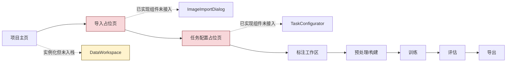
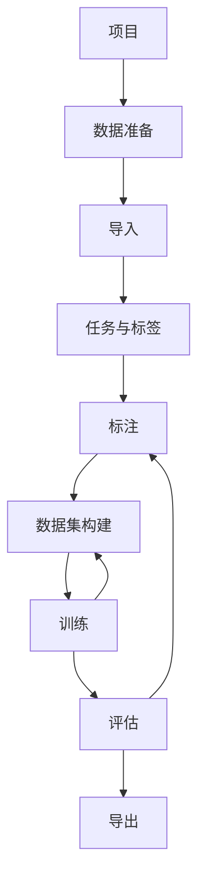

# X-AnyLabeling 深度学习平台 UI 交互审计与整改计划

> **评审角色**：桌面客户端 UI 设计总监  
> **产品定位**：Windows 桌面离线单机深度学习平台  
> **评审日期**：2026-06-07  
> **评审方法**：源码静态审计、主流程状态分析、Nielsen 十项可用性原则、认知负荷检查、典型角色走查、竞品工作流对照  
> **重要边界**：当前审计环境未安装 PyQt6，无法启动程序进行像素级视觉、动画、键盘焦点和高 DPI 实测；本文对页面结构、信号连接、状态流、异常路径和功能可达性的结论来自源码。所有视觉尺寸与可访问性结论应在整改后通过 Windows 运行态复核。

---

## 1. 执行摘要

当前工程已经从“标注工具”向“深度学习平台”扩展，具备项目主页、数据导入、任务配置、标注、数据集构建、训练、评估和导出的组件雏形，也已经建立本地项目、任务、作业和训练运行等服务对象。方向是正确的，且训练页的“快速 / 高精度 / 自定义”渐进式配置、任务相关工具显隐、离线本地服务等设计具有良好基础。

但从实际用户任务链看，当前版本仍不是一个可完整使用的“一站式平台”，主要问题不是页面数量不足，而是**页面之间没有形成可靠、可恢复、可验证的闭环**：

1. **正式导航中的“导入数据”和“任务配置”仍加载占位页**，已实现的组件没有接入主工作台；新建空项目后还会自动跳转到占位页。
2. **数据工作区被实例化但未加入页面栈**；普通图片场景下，数据集构建入口又可能被错误禁用。
3. **顶层同时展示 8 个流程步骤**，主窗口还长期占用项目树、全局检查器和底部任务台；标注页内部再重复一套资产列表和检查器，导致工作区被严重压缩。
4. 多个控件“看起来可用但实际不生效”，包括导入标注、超大图检测、增强选项、边缘策略、构建预览、评估对比等。这类“虚假可供性”比暂时不显示功能更危险。
5. 数据集、训练运行、评估和导出之间缺少严格的版本与来源绑定；部分回退逻辑可能把训练运行与错误的数据集构建关联。
6. 错误信息大量直接显示 Python 异常文本，缺少用户能理解的原因、恢复动作和数据保护说明。
7. 当前信息架构仍以“功能模块拼接”为中心，不是以“从数据到可部署模型”的任务完成为中心。

**总体设计健康度：13 / 40，评级为“较差，需要核心流程重构”。**

### 最优先结论

首轮整改不应继续增加页面或算法入口，而应先完成以下三件事：

- **打通项目 → 数据导入 → 任务定义 → 标注 → 数据集构建 → 训练 → 评估 → 导出的真实闭环**；
- **把顶层导航收敛为 5 个一级域，并用局部步骤承载数据准备内部流程**；
- **建立统一的流程状态、版本来源、后台作业和错误恢复模型**。

---

## 2. 评审范围与工程现状

### 2.1 工程状态

压缩包中的工程位于分支 `vision_platfrom`，当前工作树包含较多未提交的 UI 与平台代码修改。本文以压缩包中的当前工作树为基准，而不是以 GitHub 上游 X-AnyLabeling 的默认界面为基准。

主要评审目录：

```text
anylabeling/views/platform/
├── workbench_window.py
├── navigation_bar.py
├── project_home.py
├── new_project_dialog.py
├── image_import_dialog.py
├── task_configurator.py
├── data_workspace.py
├── label_workspace.py
├── preprocess_workspace.py
├── train_workspace.py
├── evaluate_workspace.py
├── export_workspace.py
├── job_console.py
└── style.py
```

### 2.2 当前代码表达出的目标流程


该流程与主流深度学习平台的大方向一致，但在当前实现中存在以下断点：



### 2.3 产品边界

本产品是 Windows 离线单机软件，因此本次方案明确不引入：

- 云端账户、团队协作、在线审核；
- 在线数据湖、远程数据库、Web 控制台；
- 在线训练资源调度和 SaaS 计费；
- 依赖互联网的模型市场或遥测；
- 为“看起来像平台”而引入的复杂权限体系。

但离线并不意味着可以缺少“管理”。本地平台仍然需要：

- 项目文件与目录约定；
- 数据、标签、数据集构建、训练运行、模型产物的版本关系；
- 本地作业队列、日志、崩溃恢复；
- 本地模型注册、兼容性验证、导出清单；
- 可追溯的配置快照和结果报告。

---

## 3. 竞品工作流基准

本次对标不复制竞品外观，而提取适用于离线桌面工具的交互原则。

| 平台 | 可借鉴的核心工作流 | 对本项目的启示 | 不应照搬 |
|---|---|---|---|
| MVTec Deep Learning Tool | 标注、训练、评估、数据管理、部署位于同一工具；支持自动标签、训练参数与数据拆分、训练进度、网络比较、热力图、交互式混淆矩阵、报告和导出 | 形成连续主流程；评估结果可直接回到样本；数据与结果有明确来源 | 商业授权与其特定模型体系 |
| 海康机器人深度学习/VM 体系 | 图形化配置，强调采集—训练—检测的完整链路和工业现场可操作性 | 使用工业用户熟悉的术语、明确的状态反馈、尽量减少命令行和隐式配置 | 与相机、控制器强绑定的设备配置层 |
| 阿丘科技 AIDI | 从图像输入、标注、参数配置、训练、评估到导出；包含智能标注、数据增强、自动调参、增量训练、误判样本分析 | 数据准备、训练与误判闭环应是一体化任务；将“误判样本回流”做成显式操作 | 云协同、与本地产品无关的行业套件入口 |
| Ultralytics 一站式工作流 | 上传、标注、分析、配置、训练、指标查看、导出；强调实验组织、曲线、混淆矩阵、检查点与多格式导出 | 训练前给出数据分析；训练运行需要可比较；导出要围绕目标运行而不是只勾格式 | 云端 API、团队协作、在线数据管理 |

### 3.1 对标后得到的五条平台原则

1. **一个项目只保留一条主任务链**，不要让用户在多个互不相干的工具之间搬运上下文。
2. **每一步都显示“当前状态、完成条件、下一步”**。
3. **数据集构建和训练运行必须不可变、可追溯**，不能把“当前目录状态”当作历史运行依据。
4. **评估不是终点，而是回到标注和数据改进的入口**。
5. **导出不是简单格式勾选，而是面向目标运行环境的兼容性检查与交付包生成**。

---

## 4. 总体设计健康度

### 4.1 Nielsen 十项可用性评分

| # | 启发式原则 | 得分（0–4） | 当前主要问题 |
|---:|---|---:|---|
| 1 | 系统状态可见性 | 1 | 导入进度信号未真正使用；构建和导出缺少完整阶段状态；保存状态、数据过期状态和当前来源不清楚 |
| 2 | 系统与现实世界匹配 | 2 | 基本使用项目、数据、训练、评估等行业术语，但存在 `strict/crop/pad`、provider ID、原始异常和技术对象泄漏 |
| 3 | 用户控制与自由 | 1 | 长任务取消不完整；切换项目缺少未保存保护；缺少统一撤销/重试/恢复；部分页面无安全退出路径 |
| 4 | 一致性与标准 | 1 | 菜单、顶部流程导航和页面能力不一致；相同状态在全局任务台与页面内重复表达；中英文混用 |
| 5 | 错误预防 | 1 | 无任务前置校验、路径合法性和标签规则校验；允许打开尚不可执行的阶段；导出只按格式勾选启用 |
| 6 | 识别优于回忆 | 2 | 主要流程可见，但一次展示 8 个步骤；当前数据集、运行和模型来源不持续可见；图标与 emoji 缺少稳定标签 |
| 7 | 灵活性与效率 | 2 | 标注工具具有一定快捷操作基础，训练有模式切换；但缺少全局快捷键、批量操作、最近操作和专家路径 |
| 8 | 美观与极简设计 | 1 | 永久四区布局叠加页面内部侧栏；大量 GroupBox、面板和相同视觉权重；非当前任务信息长期占空间 |
| 9 | 错误识别、诊断与恢复 | 1 | 多数错误直接展示异常字符串；没有“原因—影响—修复动作”；评估错误可能只显示 N/A |
| 10 | 帮助与文档 | 1 | 少量 tooltip，但缺少任务级引导、参数解释、空状态说明、上下文帮助和首次使用路径 |
| **总分** |  | **13 / 40** | **较差：核心体验存在结构性断点，应在正式发布前重构** |

### 4.2 认知负荷检查

| 检查项 | 结论 | 说明 |
|---|---|---|
| 单一焦点 | 失败 | 主窗口长期同时显示项目树、当前页面、全局检查器和任务台；标注页再叠加内部侧栏 |
| 信息分块 | 部分通过 | 训练页有模式分层，但多数页面仍把多个阶段能力同时展开 |
| 相关内容分组 | 失败 | 导入、任务、数据概况和数据集构建被分散为不同入口，用户需建立自己的关系图 |
| 视觉层级 | 失败 | 8 个顶层步骤地位相同；页面内多组框和按钮竞争注意力 |
| 一次一个决定 | 失败 | 新建项目、任务模板、标签、数据规则、增强和切分等概念缺少顺序化引导 |
| 最少选择 | 失败 | 顶层同时出现 8 个步骤；导出页多个格式和选项一次性显示 |
| 工作记忆负担 | 失败 | 用户需记住当前任务类型、数据构建、训练运行及模型来源，页面没有持续上下文 |
| 渐进披露 | 通过 | 训练页“快速/高精度/自定义”方向正确，可扩展为全平台模式 |
| **失败项** | **6 / 8** | **高认知负荷，属于需优先整改的级别** |

---

## 5. 反模式判断

### 5.1 结论

由于缺少运行态截图，本次不能对配色、字体、阴影、动效等做完整“AI 模板感”判定。但从源码表达的界面结构看，**交互层面未通过反模式检查**，主要表现为：

- 用“功能卡片 + GroupBox + 按钮”堆叠代替任务流设计；
- 顶部横向平铺全部流程入口，缺少主次和阶段状态；
- 以增加面板表达“平台感”，导致内容画布被重复侧栏挤压；
- 使用 emoji 充当稳定的桌面图标资源；
- 多个控件先做外观、后补功能，产生“可点击但不生效”的虚假可供性；
- 以“即将推出”占位页维持完整流程外观，但用户实际无法完成流程。

### 5.2 正确整改方向

不建议继续做“更漂亮的卡片”。应优先做到：

- 少面板、强上下文；
- 少入口、强流程；
- 少占位、强可达；
- 少临时提示、强状态；
- 少技术异常、强恢复；
- 少“功能存在”，强“任务完成”。

---

## 6. 当前做得较好的部分

### 6.1 已建立平台化代码边界

`views/platform` 将平台工作台与原标注器相对隔离，便于逐步替换和测试，避免把全部逻辑继续塞入经典主窗口。

### 6.2 训练配置已有渐进披露意识

“快速 / 高精度 / 自定义”比直接把全部超参数摊开更符合初学者和专家的双路径需求。建议保留该模式，并统一到数据集构建、评估和导出。

### 6.3 已考虑任务类型对工具的影响

标注页根据任务类型显示工具，说明工程开始从“固定标注器”转向“任务驱动平台”。后续应把这套能力判断扩展为统一的 `CapabilityRegistry`，控制任务、算法、评估指标和导出格式。

### 6.4 已有本地项目、作业和运行对象

离线平台不需要联网数据库，但需要本地可追溯对象。现有服务层是正确基础，后续重点是让 UI 持续展示并严格使用这些对象，而不是依赖隐式目录状态。

---

## 7. 优先级问题清单

> 优先级定义：P0 阻断任务完成；P1 严重影响理解、正确性或效率；P2 有替代路径但体验明显受损；P3 视觉与细节优化。

### 7.1 P0：发布阻断问题

#### P0-01 正式流程无法进入真实导入与任务配置

**证据位置**

- `workbench_window.py::_create_pages`
- `workbench_window.py::_load_page`
- `ImageImportDialog` 与 `TaskConfigurator` 已存在，但没有成为页面栈中的正式步骤

**影响**

新建空项目后自动进入“导入”步骤，却看到“即将推出”；用户无法从官方入口完成项目初始化。该问题直接否定“一站式平台”定位。

**整改**

- 将导入改为嵌入式 `ImportWorkspace`，不再以一次性模态框作为唯一入口；
- 将 `TaskConfigurator` 接入页面栈；
- 导入完成后显示结果报告和主按钮“继续配置任务”；
- 任务保存后显示“继续标注”；
- 删除已经有实现的步骤中的“即将推出”占位。

**验收**

从空项目开始，不访问文件系统、不调用隐藏菜单即可完成导入、任务定义和进入标注。

---

#### P0-02 数据工作区不可达，普通图片可能无法构建数据集

**证据位置**

- `workbench_window.py::set_project` 创建 `DataWorkspace`，但未替换页面栈中的任何页面；
- `preprocess_workspace.py` 仅在存在“超大图列表”时启用构建；
- 构建预览存在默认虚拟数量和尺寸。

**影响**

普通 640×640、1024×1024 等数据集可能无法进入构建流程；页面还可能显示基于虚拟数据的可信数字。

**整改**

- 统一为“数据准备”一级域；
- 数据概览读取项目全部资产，而不是仅读取超大图；
- “切片”作为按条件出现的高级步骤，普通图像可以直接切分并构建；
- 无真实数据时显示明确空状态，禁止显示虚构统计；
- 数据集构建必须引用真实资产清单和标签清单。

---

#### P0-03 导入与预处理存在“控件显示但功能未执行”

**典型项目**

- 导入线程声明了进度信号但没有逐阶段发出；
- “导入标注”“检测超大图”等选项未真正进入服务调用；
- 增强配置未传给数据集构建；
- 边缘策略在处理器中被固定为 `crop`；
- 构建预览按钮无有效连接；
- 手动切分策略没有手动分配界面；
- 评估对比选择框无有效对比行为。

**影响**

用户基于 UI 做出的选择不能影响结果，会导致不可察觉的数据错误。工业软件中这比禁用或隐藏功能更严重。

**整改原则**

任何尚未完成的选项必须满足二选一：

1. 从正式界面移除；
2. 明确禁用，并显示“尚未支持”的原因。

禁止保留“可操作但无效”的控件。

---

#### P0-04 资产扫描与“按文件夹分组”策略冲突

**证据位置**

- 导入支持按目录分组；
- 标注和主工作台的资产扫描主要只读取顶层文件。

**影响**

用户选择分组后，导入成功的图片可能在标注页和后续数据集构建中“消失”。

**整改**

- 使用统一 `AssetRepository` 递归读取，不允许各页面自行扫描目录；
- 资产对象保存相对路径、组、尺寸、标签状态和校验值；
- 所有页面通过资产 ID 访问，而不是重新 `glob`；
- 对 1 万级以上资产使用分页或虚拟列表。

---

#### P0-05 训练、评估与数据集来源绑定不可靠

**证据位置**

- 训练工作区局部创建，但部分刷新逻辑依赖未保存的 `self._train_workspace`；
- 评估在找不到运行对应的数据集时可能回退到第一个数据集构建；
- 导出 provider 存在硬编码检测类型的情况。

**影响**

评估结果可能对应错误的数据版本；分割、分类、姿态等任务可能使用错误导出逻辑。该问题属于结果正确性风险。

**整改**

- 每次训练运行必须保存 `task_spec_id + dataset_build_id + algorithm_id + config_snapshot + base_model_hash`；
- 评估只能选择与运行绑定的数据集和权重，不允许静默回退；
- 找不到来源时阻止评估，并提供“修复项目引用”；
- 导出格式和 provider 由运行能力推导，不允许硬编码；
- 页面始终显示“当前运行基于哪个数据集构建”。

---

#### P0-06 评估结果存在误导性展示

**证据位置**

- 部分类别表把同一 AP 值重复显示为 `mAP50` 与 `mAP50:95`；
- Precision、Recall 等缺失时仍展示结构；
- 评估错误可能被送入普通指标渲染，最终只显示 N/A。

**影响**

用户可能据此选择错误模型，属于严重决策风险。

**整改**

- 指标不存在时明确显示“本次评估未生成”，不能用同一值补齐；
- 错误状态使用专门错误面板，不进入正常指标渲染；
- 评估 schema 按任务类型定义；
- 显示指标计算数据集、样本数、阈值和时间；
- 对比功能未完成前移除对应控件。

---

### 7.2 P1：正式发布前必须解决

#### P1-01 顶层信息架构过度平铺

8 个步骤同时可见，且项目打开后全部启用。用户不知道哪些已完成、哪些可开始、哪些会使用过期数据。

**整改**：顶层收敛为 5 个一级域，内部使用局部步骤导航，见第 9 章。

---

#### P1-02 主工作台面板重复，画布空间被持续侵占

全局项目树、全局检查器、全局任务台与页面自己的资产/检查器并存。训练、评估、导出时，右侧检查器通常无意义。

**整改**

- 一级工作区只保留标题栏、一级导航和内容区；
- 页面自己决定是否显示局部侧栏；
- 检查器改为上下文抽屉，仅在标注、误判样本查看等场景出现；
- 任务台改为状态栏入口 + 可展开任务中心，不永久占高。

---

#### P1-03 缺少统一流程状态与前置条件

当前只要打开项目，所有步骤都可点击，没有“未开始 / 进行中 / 已完成 / 已过期 / 需处理”。

**整改**：建立统一 `WorkflowState`，见第 10 章。

---

#### P1-04 新建项目向导会制造错误默认值

任务模板标记为“可选”，但默认选中缺陷检测；创建后还可能生成硬编码的 `object` 标签。

**整改**

- 两步向导：基本信息 → 初始化方式；
- 默认选择“稍后配置任务”，而不是猜测业务；
- 模板卡说明可用算法、标签形式和导出能力；
- 创建前验证 Windows 文件名、重复路径、可写性和磁盘空间；
- 标签不能使用无业务含义的硬编码默认值。

---

#### P1-05 任务配置没有可靠保存与规则校验

标签表直接编辑后可能不回写内部数据；没有重复、空标签等校验；最小面积和最小数量等规则没有进入任务对象。

**整改**

- 使用单一数据模型驱动表格；
- 所有编辑通过 model signal 更新；
- 保存前检查空名称、重复名称、非法字符和冲突；
- 任务规则进入持久化 `TaskSpec`；
- 修改任务类型时先显示影响清单，并支持取消后恢复旧值；
- 算法未支持的任务类型不应出现在可选列表中。

---

#### P1-06 长任务仍可能阻塞 UI，取消语义不完整

数据集构建可能直接在 UI 线程执行；导入对话框关闭不等于后台线程可靠取消；导出缺少完成动作。

**整改**

- 导入、分析、切片、构建、训练、评估和导出统一进入 JobService；
- 作业状态统一为 queued/running/canceling/succeeded/failed/canceled；
- 窗口关闭前询问保留后台任务或取消；
- 取消必须是协作式取消，有超时和“正在安全停止”状态；
- 支持失败重试、打开输出目录和查看详细日志。

---

#### P1-07 错误文本面向开发者，不面向用户

大量弹窗直接显示异常对象，无法说明用户该做什么，也可能暴露路径和实现细节。

**整改**

统一错误对象：

```python
UserFacingError(
    title="数据集构建失败",
    summary="有 12 张图片无法读取。",
    cause_code="ASSET_DECODE_FAILED",
    actions=[
        Action("查看问题文件"),
        Action("跳过并继续"),
        Action("打开详细日志"),
    ],
    technical_detail=traceback_text,
)
```

普通区域只显示标题、影响和恢复动作；技术详情折叠展示并可复制。

---

#### P1-08 标注保存和审阅闭环不完整

自动保存只覆盖部分画布事件；没有持续保存状态、统一脏标记、审阅/退回、误判回流和批量状态。

**整改**

- 所有标注变化汇聚到 `documentChanged`；
- 500–1000 ms 防抖自动保存；
- 顶部显示“已保存 / 正在保存 / 保存失败”；
- 保存失败时保留内存副本并提供重试；
- 增加“未标注、已标注、待复核、已复核、需修改”状态；
- 评估误判样本可一键加入“待复核集合”。

---

#### P1-09 训练配置缺少离线本地模型管理

模型路径是普通文本框；推荐仅基于图片数量，未考虑任务、显存、分辨率和类别数；推荐结果也不真正应用。

**整改**

- 建立“本地模型库”：名称、算法、任务、权重路径、hash、输入尺寸、来源；
- 自动检测 GPU、显存、CUDA/CPU 环境；
- 推荐必须可“一键应用”，并说明依据；
- 基础模式只显示 4 个以内的关键选择；
- 高级参数放入可搜索参数面板；
- 运行前给出数据、设备、磁盘和输出路径检查。

---

#### P1-10 导出缺少目标环境和交付验证

当前以多个格式复选框为中心，未围绕 CPU/GPU、运行时、动态输入、任务类型组织；预览树是静态的。

**整改**

导出改为三步：

1. **选择目标环境**：Windows CPU / NVIDIA GPU / OpenVINO / TensorRT / 通用 ONNX；
2. **兼容性检查**：任务、算子、输入尺寸、动态 batch、精度、依赖；
3. **生成并验证交付包**：模型、标签、预处理、后处理、示例配置、校验值、自测结果。

完成后提供“打开输出目录”“复制部署说明”“注册为本地预标注模型”。

---

### 7.3 P2/P3 问题

| 编号 | 优先级 | 问题 | 建议 |
|---|---|---|---|
| UX-21 | P2 | 最近项目只能双击打开 | 单击选中后显示“打开”，并提供右键菜单、移除、修复路径、打开目录 |
| UX-22 | P2 | 项目状态横幅始终偏成功语义 | 根据缺失文件、过期构建、失败任务显示健康状态 |
| UX-23 | P2 | 中英文、内部标识混用 | 建立 UI 术语表，内部 ID 不直接显示 |
| UX-24 | P2 | 类别分布使用多行文本 | 使用可交互条形图，并支持点击过滤资产 |
| UX-25 | P2 | 训练/任务数字字段使用文本框 | 使用 QSpinBox/QDoubleSpinBox，提供范围、单位和即时校验 |
| UX-26 | P2 | 评估页面一次展示过多区域 | 首屏只展示 3–4 个核心 KPI 与主结论，细节分层展开 |
| UX-27 | P2 | 标注资产搜索能力弱 | 增加状态、类别、目录、尺寸、是否有 AI 建议等筛选 |
| UX-28 | P2 | 无全局快捷键帮助 | 增加 `Ctrl+K` 命令面板和 `?` 快捷键帮助 |
| UX-29 | P2 | 高 DPI 下固定高度与无滚动风险 | 所有配置页使用滚动容器，支持 125%–200% DPI |
| UX-30 | P3 | emoji 图标在 Windows 字体下不稳定 | 使用统一 SVG 图标库，并给所有图标按钮文本或 tooltip |
| UX-31 | P3 | 状态主要依靠颜色 | 使用图标、文本、形状三重编码 |
| UX-32 | P3 | 暗色主题中的浅色状态横幅不统一 | 将状态颜色纳入主题 token，验证对比度 |
| UX-33 | P3 | 焦点态覆盖不完整 | 为按钮、列表、标签页、树和自定义画布补齐清晰焦点环 |

---

## 8. 页面级评审与整改

### 8.1 项目主页

#### 当前问题

- 最近项目主要依靠双击，动作不可发现；
- 缺失路径、版本不兼容、上次异常退出等状态没有明确处理；
- 项目摘要更像静态成功卡片；
- “新建”和“打开”之后缺少最近任务恢复。

#### 目标交互

```text
项目主页
├── 继续上次工作
│   └── 项目名 / 上次页面 / 未完成作业 / [继续]
├── 最近项目
│   ├── 健康状态
│   ├── 修改时间
│   ├── 当前阶段
│   └── 打开 / 打开目录 / 移除 / 修复路径
└── 新建项目 / 打开项目
```

#### 验收

- 用户进入软件 5 秒内知道如何继续；
- 单击即可发现打开动作；
- 项目损坏时不显示普通成功状态；
- 不联网也能完整恢复最近项目列表。

---

### 8.2 新建项目

#### 建议改为两步向导

**步骤 1：项目位置**

- 项目名称；
- 保存目录；
- 最终路径实时预览；
- Windows 非法字符、保留名、重复路径、不可写和磁盘空间即时验证。

**步骤 2：初始化方式**

- 稍后配置任务（默认）；
- 从模板创建；
- 从已有项目复制任务定义；
- 导入已有数据集结构。

每次只显示一个主按钮：

- 第一步：“下一步”
- 第二步：“创建项目”

---

### 8.3 数据导入

#### 当前问题

模态对话框不适合大型离线数据导入；进度不真实；部分选项未生效；成功后自动关闭，用户看不到警告与结果。

#### 建议改为嵌入式页面

```text
数据准备 / 导入
┌───────────────────────────────────────────────┐
│ 来源                                               │
│ [添加文件] [添加文件夹] [拖入此处]                 │
│ 路径列表、预计数量、总大小、可读性                   │
├───────────────────────────────────────────────┤
│ 导入规则                                           │
│ 复制到项目 / 引用原位置                             │
│ 重复处理：跳过 / 保留副本 / 替换                    │
│ 目录作为分组                                        │
│ 标注格式：不导入 / YOLO / COCO / VOC（仅支持项显示） │
├───────────────────────────────────────────────┤
│ 预检结果                                           │
│ 可导入 9,982 / 重复 16 / 损坏 2 / 不支持 5          │
├───────────────────────────────────────────────┤
│ [取消]                         [开始导入]            │
└───────────────────────────────────────────────┘
```

#### 作业阶段

1. 扫描；
2. 读取元数据；
3. 计算重复；
4. 复制或建立引用；
5. 解析标注；
6. 写入资产清单；
7. 生成报告。

每个阶段必须显示已完成数量、总量、当前文件和可安全取消状态。

---

### 8.4 任务与标签配置

#### 建议结构

- **推荐任务**：根据已导入标注格式、目录结构和图像特征给出建议，但必须说明依据；
- **任务类型**：只显示当前版本真正支持训练、评估和导出的任务；
- **标签集合**：名称、颜色、快捷键、启用状态、样本数；
- **标注规则**：最小面积、是否允许重叠、是否需要实例 ID 等；
- **影响提示**：修改任务或标签会使哪些数据集构建过期。

#### 交互原则

- 推荐必须有“应用推荐”，不能只是文本；
- 标签编辑必须即时同步并校验；
- 0 个标签时不能进入需要类别的任务；
- 任务切换前展示影响，不清空数据后再询问；
- “保存并进入标注”是唯一主按钮。

---

### 8.5 标注工作区

#### 推荐布局

```text
┌ 顶部：项目 / 数据集 / 当前资产 / 保存状态 / 快捷动作 ┐
├────────────┬────────────────────────────┬────────────┤
│ 资产列表    │ 画布                        │ 上下文属性  │
│ 搜索/筛选   │ 工具条                      │ 标签/几何   │
│ 状态/缩略图 │ 原图/标注/AI建议              │ 历史/质检   │
├────────────┴────────────────────────────┴────────────┤
│ 底部状态：坐标、缩放、图像尺寸、标注数量、提示         │
└─────────────────────────────────────────────────────┘
```

仅在标注页面出现这三栏，主工作台不再额外叠加全局项目树和检查器。

#### 必须补齐

- 统一自动保存与失败恢复；
- 标注状态筛选；
- 批量设置状态、标签与分组；
- AI 预标注进度、取消、接受/拒绝；
- 误判样本集合；
- 快捷键提示与命令面板；
- 超大图加载状态、瓦片加载和缩放反馈；
- 资产切换时未保存保护。

---

### 8.6 数据集构建

建议将当前“预处理”改名为更符合用户目标的“数据集构建”。

#### 页面分层

**基础**

- 数据来源；
- 训练/验证/测试比例；
- 随机种子；
- 输出尺寸；
- 一键构建。

**切片**

仅在存在大图或用户启用时显示：

- 切片尺寸；
- 重叠；
- 边缘处理；
- 截断标签策略；
- 空白图保留策略；
- 切片预览。

**增强**

- 增强配方；
- 每项概率和范围；
- “查看增强样例”；
- 区分离线生成和训练时增强。

**高级**

- 分层切分、按产品切分、按组切分；
- 防数据泄漏规则；
- 类别平衡；
- 自定义清单。

#### 构建前确认

显示：

- 原图数量；
- 有标注/无标注数量；
- 类别分布；
- 预计切片数量；
- 预计磁盘占用；
- 重复和损坏样本；
- 产品或组跨集合泄漏风险。

构建完成后生成不可变 `DatasetBuild`，并提供：

- “开始训练”；
- “查看清单”；
- “打开输出目录”；
- “基于此版本复制配置”。

---

### 8.7 训练与实验

#### 推荐首屏

```text
训练
├── 就绪检查
│   ├── 任务：实例分割
│   ├── 数据集：build-20260607-003
│   ├── 训练 8,000 / 验证 1,500 / 测试 500
│   ├── 设备：RTX ... / 24 GB
│   └── 磁盘：预计需要 ...
├── 配置模式：快速 / 高精度 / 自定义
├── 本地基础模型
├── 4 个以内关键参数
└── [开始训练]
```

#### 运行中

- 状态、阶段、epoch、预计剩余时间；
- loss、核心指标、学习率和显存；
- 暂停（真正支持时才显示）、安全停止、保存检查点；
- 页面关闭后作业继续；
- 重开软件后能恢复到运行详情；
- 原始日志放到“详细日志”，不占主屏。

#### 运行完成

- 最佳 epoch；
- 最佳权重、最后权重；
- 核心指标；
- 与基线对比；
- “开始评估”“导出最佳模型”“用于预标注”。

---

### 8.8 评估

#### 首屏只保留 4 个关键区

1. 运行与数据来源；
2. 3–4 个核心 KPI；
3. 主要结论；
4. 主操作：“查看误判样本”。

#### 详细页签

- 指标曲线；
- 混淆矩阵；
- 每类指标；
- PR/F1 曲线；
- 速度和资源；
- 误判样本。

#### 关键闭环

误判样本支持：

- 打开原图与预测；
- 查看 GT、预测、置信度；
- 标记为标注错误、困难样本、模型漏检、模型误检；
- 一键加入“待复核”；
- 生成新数据集构建，而不是修改历史构建；
- 重新训练时可选择“基于上一运行”。

---

### 8.9 导出

#### 用“目标环境”代替“格式墙”

推荐预设：

- 通用 ONNX；
- Windows CPU；
- NVIDIA GPU / TensorRT；
- Intel CPU / OpenVINO；
- 本平台本地预标注模型；
- 自定义。

选择预设后，仅显示相关参数；不相关选项隐藏。

#### 导出前检查

- 运行已完成；
- 任务类型支持；
- 权重存在且 hash 一致；
- 输入尺寸和动态维度兼容；
- 后处理可用；
- 标签与预处理配置完整；
- 输出目录可写；
- 加密密码有效且已确认。

#### 导出完成

```text
导出成功
位置：D:\...\model-package
模型：best.onnx
校验：通过
自测：20/20 样本推理成功
[打开目录] [复制部署说明] [注册为本地预标注模型]
```

---

## 9. 目标信息架构

### 9.1 顶层由 8 步收敛为 5 个一级域

```text
1. 项目
2. 数据准备
3. 训练
4. 评估
5. 导出
```

“数据准备”内部再使用不超过 4 个局部步骤：

```text
导入 → 任务与标签 → 标注 → 数据集构建
```

这样兼顾两类用户：

- **首次用户**：按局部步骤完成；
- **专家用户**：从一级域或命令面板直接跳转，但页面仍展示前置条件。

### 9.2 目标导航结构



### 9.3 主窗口布局

```text
┌──────────────────────────────────────────────────────────────┐
│ 应用标题 | 当前项目 | 数据/任务上下文 | 全局搜索 | 任务中心 │
├──────────────────────────────────────────────────────────────┤
│ 一级导航：项目  数据准备  训练  评估  导出                  │
├──────────────────────────────────────────────────────────────┤
│ 页面标题 / 局部步骤 / 状态 / 主要动作                       │
├──────────────────────────────────────────────────────────────┤
│                                                              │
│                         当前页面                              │
│                                                              │
├──────────────────────────────────────────────────────────────┤
│ 本地状态 | 保存状态 | 后台作业 | 设备状态                    │
└──────────────────────────────────────────────────────────────┘
```

页面按需增加局部侧栏，不设置永久全局检查器；任务中心使用抽屉或独立窗口。

---

## 10. 流程状态模型

### 10.1 阶段状态

每个阶段统一使用：

| 状态 | 含义 | UI 表达 |
|---|---|---|
| 未开始 | 尚无输入 | 灰色文本 + 开始动作 |
| 可开始 | 前置条件满足 | 正常入口 + 推荐动作 |
| 进行中 | 有活动作业或未完成编辑 | 进度/保存状态 |
| 已完成 | 有可用产物 | 完成时间 + 产物摘要 |
| 需处理 | 存在错误或缺失 | 原因 + 修复动作 |
| 已过期 | 上游变化，已有产物不再代表当前数据 | 保留历史结果，但提示重新构建 |

不要简单把不可执行步骤全部禁用。用户仍可打开页面查看“为什么不可执行”和“去哪里修复”。

### 10.2 前置条件示例

| 阶段 | 最小前置条件 |
|---|---|
| 任务配置 | 项目已打开 |
| 标注 | 有资产；任务和标签定义有效 |
| 数据集构建 | 有资产；任务有效；需要标注的任务存在有效标注 |
| 训练 | 至少一个成功的数据集构建；算法与任务兼容；基础模型可用 |
| 评估 | 至少一个已完成训练运行；权重和绑定数据集可访问 |
| 导出 | 已完成运行；目标格式与任务兼容；产物完整 |

### 10.3 失效传播

```text
资产新增/删除
└── 数据集构建变为“已过期”
    └── 历史训练运行保留，不改写
        └── 历史评估和导出保留

任务类型或标签 schema 变化
├── 当前标注可能“需迁移”
├── 数据集构建变为“已过期”
└── 历史运行只读保留

标注变化
└── 数据集构建变为“已过期”
```

核心原则：**上游变化不能静默修改历史运行；只能提示创建新版本。**

---

## 11. 角色走查

### 11.1 Alex：高频专家用户

**主任务**：打开已有项目，构建新数据版本，启动训练并比较结果。

**当前红旗**

- 顶层 8 步与永久面板增加指针移动和视觉查找；
- 无统一命令面板和全局快捷键；
- 数据构建、训练和评估上下文需要重复选择；
- 页面内日志与全局任务台重复；
- 无批量运行操作、复制运行配置和快速对比；
- 模态导入不适合长批次。

**整改后目标**

- `Ctrl+K` 直接执行“构建数据集”“复制上次训练”“比较运行”；
- 最近数据集和运行保持上下文；
- 运行详情可复制配置；
- 任务中心集中管理所有后台作业；
- 专家路径不强制通过向导，但必须满足同样校验。

---

### 11.2 Jordan：首次使用者

**主任务**：从空项目开始训练第一个模型。

**当前红旗**

- 新建后跳到“导入”占位页，第一步即中断；
- 8 个同权重入口无法判断顺序；
- 默认缺陷模板和 `object` 标签可能被误认为正确配置；
- 多个英文内部参数没有解释；
- 没有明确的“当前完成条件”和“下一步”；
- 操作成功与否经常依赖弹窗或无反馈。

**整改后目标**

- 项目创建后进入明确的“添加数据”空状态；
- 数据准备局部步骤逐项引导；
- 每页只保留一个主按钮；
- 参数旁有简短任务级说明；
- 步骤完成后显示结果摘要和下一步；
- 错误给出可执行修复动作。

---

### 11.3 Riley：压力与边界测试用户

**主任务**：导入复杂目录和异常数据，切换项目，故意中断任务并验证恢复。

**当前红旗**

- 目录分组后资产可能无法被顶层扫描；
- 不支持扩展名的文件可能进入待导入列表；
- 关闭导入对话框不等同于安全取消线程；
- 普通图片可能无法构建；
- 切换项目时已加载页面与状态可能残留；
- 评估可能静默回退到错误数据集；
- “清除已完成任务”可能刷新后重新出现；
- 原始异常可能直接泄漏到用户界面。

**整改后目标**

- 统一资产仓储与递归索引；
- 导入前预检、问题文件清单和可恢复报告；
- 所有作业支持安全取消、重试和重启恢复；
- 项目切换建立独立 Session 并清空旧上下文；
- 任何来源缺失都阻止执行，禁止静默回退；
- 任务清理语义真实且持久。

---

### 11.4 Sam：键盘与低视力用户

**当前红旗**

- 22 px 等固定小按钮不利于操作；
- emoji、颜色和 hover 可能承担过多语义；
- 部分配置页缺少滚动容器；
- 自定义组件的焦点顺序、焦点环和键盘完成路径尚未验证；
- 高 DPI 下固定窗口和多侧栏可能导致内容截断。

**整改后目标**

- 常用点击目标不小于 32×32 px，关键动作更大；
- 所有状态同时使用文本和图标；
- 完整键盘路径、可见焦点、合理 Tab 顺序；
- 支持 125%、150%、200% DPI；
- 界面缩放后不丢主操作、不出现水平溢出；
- 在 Windows NVDA 环境补充基本可访问名称。

---

## 12. 代码级整改映射

### 12.1 `workbench_window.py`

| 当前问题 | 调整动作 |
|---|---|
| 导入、任务、标注使用占位页 | 正式注册 `ImportWorkspace`、`TaskConfigurator`、`LabelWorkspace` |
| DataWorkspace 创建但不可达 | 合并进入“数据准备/导入后的数据概览” |
| 页面实例和成员引用不一致 | 页面统一由 `WorkspaceRegistry` 创建、缓存、销毁 |
| 切换项目可能残留状态 | 引入 `ProjectSession`，切换时统一 detach/attach |
| 构建忽略部分 UI 配置 | 使用强类型 `DatasetBuildRequest`，禁止手工拼字典 |
| 评估静默回退数据集 | 删除回退；来源缺失时返回可恢复错误 |
| 导出 provider 硬编码 | 由 `CapabilityRegistry.resolve_exporter(run)` 决定 |
| 永久四区布局 | 改为主内容 + 按需局部面板；任务中心抽屉化 |

### 12.2 `navigation_bar.py`

- 将 8 步顶层导航重构为 5 个一级域；
- 增加状态徽标和当前阶段；
- 不再在“项目已打开”后全部无条件启用；
- 点击不可执行区域时显示前置条件，而不是仅禁用；
- 删除 `INFER = PREPROCESS` 等语义混淆别名；
- 推理验证应作为评估或导出后的独立能力，而不是伪装为预处理。

### 12.3 `image_import_dialog.py`

- 拆为 `ImportWorkspace + ImportJob`；
- 修复文件过滤逻辑，必须是“文件且扩展名受支持”；
- 实际发出扫描、复制、标注解析进度；
- 实现协作式取消和关闭保护；
- 未实现的选项移除或禁用；
- 导入结束不自动关闭，显示详细报告；
- 保存导入报告和问题文件清单。

### 12.4 `task_configurator.py`

- 使用表格 model 而不是独立 `_labels` 双状态；
- 标签修改、删除、排序统一进入 undo stack；
- 保存重复、空值和非法字符校验；
- 持久化任务规则；
- 任务推荐可应用并解释依据；
- 任务类型由能力注册表生成；
- 修复取消切换任务时恢复旧值；
- 修复缩略图文本覆盖 pixmap 的显示逻辑。

### 12.5 `label_workspace.py`

- 取消与主窗口重复的全局侧栏；
- 资产数据来自统一仓储；
- 递归目录和分组可见；
- 统一 `documentChanged`、防抖保存和错误状态；
- 补齐删除、属性编辑、批量变更等脏状态；
- 增加状态/类别/组筛选；
- AI 建议具有作业状态、接受/拒绝和审阅记录；
- 使用虚拟列表支持大数据集。

### 12.6 `preprocess_workspace.py`

- 重命名为 `DatasetBuildWorkspace`；
- 普通图像也可构建；
- 仅真实数据参与统计；
- 连接预览按钮；
- 正确传递边缘策略、切分策略和增强配置；
- 手动切分若未实现则隐藏；
- 加入滚动容器；
- 构建进入后台作业；
- 构建产物不可变并生成 manifest。

### 12.7 `train_workspace.py`

- 工作区实例始终保存在主窗口或 registry；
- 数字参数使用强类型控件；
- 预设应用根据控件类型设置值，不假设均为文本框；
- 本地模型使用模型选择器和浏览按钮；
- 训练推荐考虑任务、数据量、输入尺寸和显存；
- 推荐可一键应用；
- 运行前展示就绪检查；
- 运行名、备注、配置快照、环境快照持久化；
- 统一任务中心，不重复大段日志。

### 12.8 `evaluate_workspace.py`

- 只显示已完成且产物完整的运行；
- 验证/测试集合显式选择；
- 指标 schema 按任务类型渲染；
- 删除伪造或重复指标；
- 对比控件正式接线，否则暂时移除；
- 误判列表可加载、筛选并回到标注；
- 混淆矩阵适配主题和窗口缩放；
- 增加进度、取消和失败状态。

### 12.9 `export_workspace.py`

- 先选运行，再选目标环境；
- 只显示兼容格式和相关选项；
- 动态生成交付包预览；
- 校验输出目录、密码、运行产物和任务能力；
- 导出完成显示自测与校验结果；
- “自动注册”改名为“注册为本地预标注模型”；
- 提供打开目录和复制部署说明。

### 12.10 `job_console.py`

- 改为任务中心；
- 每条任务显示名称、项目、阶段、进度、开始时间；
- 支持取消、重试、打开结果、查看详情；
- “清除已完成”必须真正影响持久可见列表；
- 普通用户查看摘要，技术日志折叠；
- 错误文案使用“本地任务服务”，避免误导为网络连接；
- 支持软件重启后恢复正在运行或失败的作业状态。

### 12.11 `style.py`

- 状态颜色全部 token 化并支持明暗主题；
- 不依赖颜色单独传递状态；
- 统一 SVG 图标；
- 补齐焦点态；
- 避免固定小尺寸；
- 建立 4/8 px 间距体系和页面模板；
- 配置页默认支持滚动与高 DPI。

---

## 13. 推荐数据对象与 UI 状态边界

建议在 UI 与服务之间使用明确的请求和快照对象，避免页面直接拼接参数。

```python
@dataclass(frozen=True)
class DatasetBuildRequest:
    project_id: str
    task_spec_id: str
    asset_query: AssetQuery
    split_config: SplitConfig
    tiling_config: TilingConfig | None
    augmentation_config: AugmentationConfig | None
    random_seed: int

@dataclass(frozen=True)
class TrainingRunRequest:
    dataset_build_id: str
    algorithm_id: str
    base_model_id: str
    config: Mapping[str, Any]
    device_id: str
    run_name: str

@dataclass(frozen=True)
class EvaluationRequest:
    training_run_id: str
    checkpoint_id: str
    dataset_split: Literal["val", "test"]
    thresholds: EvaluationThresholds

@dataclass(frozen=True)
class ExportRequest:
    training_run_id: str
    checkpoint_id: str
    target_profile_id: str
    output_dir: Path
    options: ExportOptions
```

UI 必须展示这些对象的 ID、名称和来源摘要，用户才能知道“当前看到的结果基于什么”。

---

## 14. 实施路线图

### 阶段 A：闭环修复（P0）

**目标**：用户可以从空项目走完一次真实流程。

| 工作项 | 预计人日 |
|---|---:|
| 接入导入和任务配置正式页面 | 2–3 |
| 修复资产仓储与递归扫描 | 2–3 |
| 普通图像数据集构建 + 参数真实传递 | 3–4 |
| 修复训练工作区引用和来源绑定 | 1–2 |
| 修复评估错误指标与静默回退 | 2–3 |
| 导出 provider 与完成反馈 | 1–2 |
| 端到端测试 | 2 |
| **小计** | **13–19 人日** |

### 阶段 B：信息架构与统一状态

**目标**：从“8 个功能页面”转为“5 个任务域”。

| 工作项 | 预计人日 |
|---|---:|
| 5 个一级域与数据准备局部步骤 | 2–3 |
| 页面 registry 与 ProjectSession | 2–3 |
| WorkflowState 与前置条件 | 3–4 |
| 失效传播与来源上下文条 | 2–3 |
| 全局任务中心抽屉 | 2–3 |
| **小计** | **11–16 人日** |

### 阶段 C：数据、标注与数据集构建体验

| 工作项 | 预计人日 |
|---|---:|
| 嵌入式导入、预检、报告、取消 | 3–5 |
| 任务标签模型与规则保存 | 2–3 |
| 标注保存状态、筛选和质检 | 4–6 |
| 数据集构建预览、manifest、泄漏检查 | 4–6 |
| 超大图切片配置与样例预览 | 3–5 |
| **小计** | **16–25 人日** |

### 阶段 D：训练、评估与导出体验

| 工作项 | 预计人日 |
|---|---:|
| 本地模型库和训练就绪检查 | 3–5 |
| 训练运行详情与恢复 | 3–5 |
| 指标 schema、运行对比、误判闭环 | 5–7 |
| 目标环境导出与自测 | 4–6 |
| **小计** | **15–23 人日** |

### 阶段 E：稳定性、可访问性与视觉统一

| 工作项 | 预计人日 |
|---|---:|
| 统一错误中心与恢复动作 | 2–3 |
| 键盘、焦点、快捷键、命令面板 | 2–4 |
| 125%–200% DPI 与窗口尺寸测试 | 2–3 |
| 图标、颜色、间距与主题 token | 2–3 |
| 大数据量性能和崩溃恢复测试 | 3–5 |
| **小计** | **11–18 人日** |

### 总体估算

- **完整整改：66–101 人日**
- 推荐团队：
  - 1 名 Qt/PyQt UI 主开发；
  - 1 名平台/服务层开发；
  - 1 名算法与导出接口开发（可兼职）；
  - 1 名 QA/产品验收（可阶段投入）。
- 两名核心开发并行、服务层接口稳定的情况下，预计 **8–12 周**形成可发布的离线 Lite 版本。
- 若只做第一版可用闭环，优先完成阶段 A + 阶段 B 的最小集合，预计 **4–6 周**。

> 估算不含新增算法研发、训练框架改造和超大图渲染引擎重写，只包含平台 UI、状态模型、现有服务接线和必要测试。

---

## 15. 首个迭代建议

建议第一个 2 周迭代只承诺以下结果：

### Sprint 1 目标

**从空项目开始，用户可完成“导入 → 配置 → 标注 → 构建”的真实闭环。**

### Sprint 1 工作清单

1. 删除导入与任务配置的占位页；
2. 接入真实页面和信号；
3. 建立统一资产仓储，支持递归目录；
4. 修复普通图像数据集构建；
5. 修复边缘策略、增强、切分参数真实传递；
6. 未实现控件全部隐藏或禁用；
7. 数据集构建改为后台作业；
8. 建立最小流程状态；
9. 增加端到端自动化测试；
10. 验证 Windows 11、中文路径、125%/150% DPI。

### Sprint 1 不做

- 不做新的算法类型；
- 不做复杂仪表盘；
- 不做云功能；
- 不做大规模视觉换肤；
- 不做尚无后端支持的“智能”入口；
- 不扩展更多导出格式。

---

## 16. 详细整改待办

| ID | 优先级 | 交付结果 | 主要文件 | 估算 | 依赖 | 验收标准 |
|---|---|---|---|---:|---|---|
| UI-001 | P0 | 导入页正式可达 | `workbench_window.py`, `image_import_dialog.py` | 2d | 无 | 空项目可从导航进入真实导入 |
| UI-002 | P0 | 任务配置正式可达并保存 | `workbench_window.py`, `task_configurator.py` | 2d | UI-001 | 保存后重启项目仍存在 |
| UI-003 | P0 | 统一递归资产仓储 | service + label/data workspace | 3d | 无 | 分组目录内资产在所有页面一致可见 |
| UI-004 | P0 | 普通图片可构建数据集 | `preprocess_workspace.py` | 2d | UI-003 | 无大图时构建按钮正常 |
| UI-005 | P0 | 所有构建参数真实生效 | workbench + build service | 2d | UI-004 | manifest 与 UI 配置一致 |
| UI-006 | P0 | 去除无效控件 | import/preprocess/evaluate | 1d | 无 | 界面无“可点但无效果”控件 |
| UI-007 | P0 | 运行—数据集强绑定 | train/evaluate service | 3d | UI-004 | 评估不能静默选错数据集 |
| UI-008 | P0 | 评估指标正确渲染 | `evaluate_workspace.py` | 2d | UI-007 | 不重复伪造指标，错误独立显示 |
| UI-009 | P0 | 导出能力按运行推导 | `export_workspace.py` | 2d | UI-007 | 不同任务只显示兼容格式 |
| UI-010 | P1 | 顶层 5 域导航 | `navigation_bar.py` | 3d | UI-001/002 | 顶层不超过 5 个入口 |
| UI-011 | P1 | 流程状态与前置条件 | new workflow module | 4d | UI-010 | 每阶段显示状态、原因和动作 |
| UI-012 | P1 | ProjectSession 隔离 | `workbench_window.py` | 3d | UI-010 | 切项目无旧状态残留 |
| UI-013 | P1 | 任务中心抽屉 | `job_console.py` | 3d | JobService | 页面不再永久占用底部日志区 |
| UI-014 | P1 | 导入预检与真实进度 | import workspace/service | 4d | UI-003/013 | 阶段进度、取消、报告完整 |
| UI-015 | P1 | 标签模型与校验 | `task_configurator.py` | 3d | UI-002 | 编辑立即同步，重复/空值被阻止 |
| UI-016 | P1 | 标注统一自动保存 | `label_workspace.py` | 4d | UI-003 | 所有编辑类型都有保存状态 |
| UI-017 | P1 | 构建版本和 manifest | build service/workspace | 4d | UI-005 | 历史构建不可变、可复现 |
| UI-018 | P1 | 训练就绪检查 | `train_workspace.py` | 3d | UI-007/017 | 缺少输入时解释并阻止启动 |
| UI-019 | P1 | 本地模型库 | new model registry | 4d | capability registry | 权重来源、hash、任务可追踪 |
| UI-020 | P1 | 误判样本回流 | evaluate + label | 5d | UI-008/016 | 一键加入待复核集合 |
| UI-021 | P1 | 目标环境导出向导 | export workspace/service | 5d | UI-009/019 | 兼容检查、交付包、自测 |
| UI-022 | P1 | 用户化错误中心 | shared UI/error model | 3d | 无 | 错误包含原因、影响和恢复动作 |
| UI-023 | P2 | 项目主页健康与修复 | `project_home.py` | 2d | session | 缺失路径可修复或移除 |
| UI-024 | P2 | Windows 项目路径校验 | `new_project_dialog.py` | 2d | 无 | 非法名、重复、权限即时反馈 |
| UI-025 | P2 | 资产虚拟列表与筛选 | label/data workspace | 4d | UI-003 | 10 万条仍可平滑浏览 |
| UI-026 | P2 | 命令面板与快捷键帮助 | shell | 3d | UI-010 | 常用任务可键盘完成 |
| UI-027 | P2 | 运行对比 | evaluate/train | 4d | UI-008 | 至少支持 2–4 个运行关键指标对比 |
| UI-028 | P2 | 高 DPI 与滚动适配 | all workspaces | 3d | UI 稳定 | 200% DPI 不丢主操作 |
| UI-029 | P3 | SVG 图标与状态编码 | style/resources | 2d | 无 | 不再依赖 emoji 与颜色单义 |
| UI-030 | P3 | 主题与焦点统一 | `style.py` | 3d | UI 稳定 | 明暗主题、键盘焦点均通过检查 |

---

## 17. 验收场景

### 17.1 主流程

1. 首次启动，创建中文项目名；
2. 导入 100 张普通图片与 YOLO 标注；
3. 查看预检报告并跳过 2 个损坏文件；
4. 配置单类别实例分割任务；
5. 标注和修改 10 张图片；
6. 构建 70/20/10 数据集；
7. 关闭并重启软件；
8. 恢复项目和数据集构建；
9. 启动训练；
10. 查看运行进度；
11. 完成评估；
12. 查看误判并加入待复核；
13. 导出 ONNX 包；
14. 打开输出目录并查看自测报告。

全流程不得出现占位页、手工修改项目文件、命令行补救或联网依赖。

### 17.2 稳定性与边界

- 中文、空格和长路径；
- 只读目录、磁盘不足；
- 0 张、1 张、10 万张资产；
- 多级目录与同名文件；
- 损坏图像和不支持格式；
- 重复数据；
- 训练过程中关闭页面和重启软件；
- 切换项目；
- 上游标签改变后历史运行仍可查看；
- 数据集来源缺失时拒绝静默回退；
- 导出中取消；
- 125%、150%、200% DPI；
- 无 GPU 环境；
- 完全断网运行。

### 17.3 可用性指标

| 指标 | 目标 |
|---|---:|
| 新用户创建项目并进入导入页 | ≤ 30 秒 |
| 导入后找到下一步 | ≤ 5 秒 |
| 顶层一级入口数量 | ≤ 5 |
| 每页主要动作 | 1 个 |
| 普通错误恢复路径可见率 | 100% |
| 长任务具有进度和取消 | 100% |
| 历史训练运行可追溯数据构建 | 100% |
| 无效但可点击控件 | 0 |
| 关键路径键盘可完成 | 100% |
| 200% DPI 主操作可见 | 100% |
| 完全离线功能完成率 | 100% |

---

## 18. 测试策略补充

当前组件测试偏重“控件存在、数量正确、信号可发出”，不足以证明工作流可用。建议新增三层测试。

### 18.1 状态机单元测试

- 前置条件；
- 阶段状态；
- 上游变化后的过期传播；
- 运行来源绑定；
- 项目切换隔离。

### 18.2 UI 集成测试

- 创建项目；
- 导入数据；
- 配置任务；
- 标签增删改；
- 构建；
- 训练启动与停止；
- 评估；
- 导出。

重点检查“点击后实际服务请求参数”，而不是仅检查控件存在。

### 18.3 Windows 端到端测试

使用真实 Qt 事件循环验证：

- 模态窗口与线程关闭；
- 高 DPI；
- 焦点顺序；
- 长路径；
- 文件占用；
- 后台任务；
- 崩溃后恢复；
- 大资产列表性能。

需要修改现有测试中“项目打开后 8 个步骤全部启用”的假设，使测试匹配新的前置状态模型。

---

## 19. 设计系统建议

### 19.1 页面模板

统一四种页面模板：

1. **列表页**：项目、资产、运行、模型；
2. **向导页**：新建项目、导入、导出；
3. **工作台页**：标注；
4. **分析页**：数据概况、训练、评估。

### 19.2 操作层级

每页最多：

- 1 个主操作；
- 1–2 个次操作；
- 其余进入“更多”。

### 19.3 状态表达

```text
[✓ 已完成]   [● 进行中 42%]   [! 需处理]   [↻ 已过期]
```

同时使用文本、图标和颜色，不能只改变文字颜色。

### 19.4 术语表

建议统一：

| 不推荐 | 推荐 |
|---|---|
| Preprocess | 数据集构建 |
| Run | 训练运行 |
| Build | 数据集版本 |
| Provider | 算法/导出器（普通 UI 不显示内部 ID） |
| Auto register | 注册为本地预标注模型 |
| strict/crop/pad | 严格保留 / 裁切边缘 / 填充边缘 |
| Infer（混入预处理） | 推理验证 |
| Job service connection | 本地任务服务 |

---

## 20. 最终建议

当前工程最有价值的资产不是已经画出的页面，而是已经开始形成的本地项目、数据、作业和运行对象。下一阶段应停止以“页面齐全”为完成标准，改为以以下四个标准验收：

1. **用户任务是否能从头到尾完成**；
2. **每个选择是否真正改变结果**；
3. **每个结果是否能追溯到输入和配置**；
4. **发生中断或错误时是否能恢复且不丢工作**。

对离线工业深度学习平台而言，可信、可控和可追溯比视觉炫技更重要。建议优先交付一个流程完整、状态明确、错误可恢复的 Lite 版本，再逐步扩展算法、智能标注和自动调参能力。

---

## 附录 A：本次审计使用的内部评审规范

- `SKILL(2).md`：设计评审结构、Nielsen 评分、角色走查和优先级方法；
- `cognitive-load.md`：工作记忆、选项数量、渐进披露和 8 项认知负荷检查；
- `heuristics-scoring.md`：十项可用性评分与 P0–P3 严重度；
- `personas.md`：专家用户、首次用户、可访问性用户和压力测试用户走查。

---

## 附录 B：外部基准来源

以下均为官方页面，访问日期为 2026-06-07：

1. MVTec Deep Learning Tool  
   https://www.mvtec.com/products/deep-learning-tool
2. HIKROBOT Machine Vision / VisionMaster 相关官方页面  
   https://www.hikrobotics.com/
3. 阿丘科技 AIDI 官方产品页面  
   https://www.aqrose.com/
4. Ultralytics Platform 官方文档  
   https://docs.ultralytics.com/platform/
5. Ultralytics 官方训练与实验管理说明  
   https://www.ultralytics.com/

> 外部产品持续更新，实际功能范围以各厂商当前版本和授权为准。本文仅提取工作流与交互原则，不主张功能等价。
