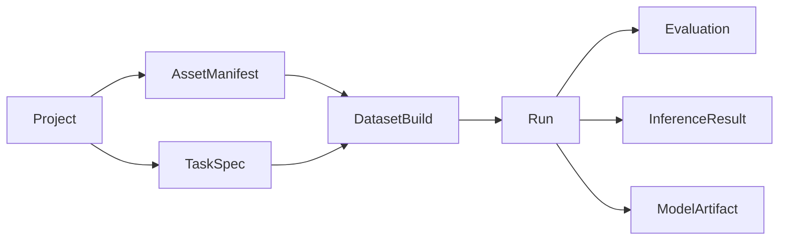

# X-AnyLabeling 离线深度学习平台产品化 UI 整改落地方案

> **文档定位**：研发执行方案 + UI 交互规格 + 产品验收基线  
> **目标产品**：Windows 桌面离线单机深度学习平台（Lite 产品版）  
> **基线工程**：当前工作树  
> **输入依据**：`X-AnyLabeling_深度学习平台_UI交互审计与整改计划.md`  
> **方案日期**：2026-06-07  
> **适用团队**：产品、UI/UX、PyQt、平台服务、算法适配、测试  
> **核心结论**：首版不追求功能最多，而是必须让用户在完全离线环境下稳定完成“项目创建 → 数据导入 → 任务配置 → 标注 → 数据集构建 → 训练 → 评估/推理验证 → ONNX 导出”的真实闭环。

---

## 1. 执行决策

当前工程已经具备项目、资产、任务、数据集构建、训练运行、评估、导出、作业和算法 Provider 等基础对象，但 UI 仍处于“页面与组件已经出现，任务闭环尚未真正成立”的阶段。

本轮整改不再以“补齐 8 个页面”为目标，而以以下四个产品结果为目标：

1. **能完成**：所有正式可见控件都能真实影响结果，核心流程没有占位页、静默回退和假数据。
2. **容易完成**：首次用户无需阅读外部手册，按界面主操作即可走完整流程。
3. **结果可信**：数据集、训练、评估、推理和导出之间具有不可变、可追溯的来源关系。
4. **长期可用**：长任务不阻塞 UI，软件异常退出后项目不损坏，错误可诊断、可恢复，离线环境不产生无意义的联网入口。

### 1.1 首版产品成功标准

首版只有同时满足以下条件，才可定义为“真实可使用产品”，而不是演示原型：

- 空项目可从正式入口完成一次完整训练与导出；
- 普通图像和超大图均能进入数据集构建；
- 超大图支持图像切分、标签同步切分、切片推理和结果合并；
- 训练运行严格绑定任务版本和数据集构建版本；
- 评估不允许静默使用错误数据集或错误权重；
- 导出至少稳定支持 ONNX，并生成标签、预处理、后处理及验证报告；
- 所有耗时操作进入后台作业，用户可以离开当前页面；
- 所有错误均提供“发生了什么、影响是什么、如何处理”；
- 断网、中文路径、Windows 高 DPI 环境下可正常使用；
- 正式界面不存在“可点击但不生效”的控件。

---

## 2. 产品边界

## 2.1 首版必须交付

| 领域 | 首版能力 |
|---|---|
| 项目 | 新建、打开、最近项目、项目健康检查、异常退出恢复 |
| 数据导入 | 文件/文件夹导入、复制或引用、递归目录、重复/损坏预检、标注导入 |
| 任务配置 | 检测、实例分割、旋转框、分类、姿态等工程已支持任务；标签与规则持久化 |
| 标注 | 基础标注、画笔 Polygon、自动保存、状态筛选、批量状态、AI 预标注入口 |
| 超大图 | 分块浏览；切片规划；图像、HBB、OBB、Polygon、Pose 标签同步切分 |
| 数据集构建 | 训练/验证/测试拆分、按组隔离、切片、增强配置、不可变 manifest |
| 训练 | YOLO Provider、本地模型选择、设备检查、参数预设、运行监控、恢复查看 |
| 评估 | 核心指标、每类指标、误判样本、阈值设置、运行来源可见 |
| 推理验证 | 单图、文件夹、切片推理、合并结果、结果叠加与导出 |
| 导出 | ONNX、交付包、自测、校验值、本地预标注模型注册 |
| 本地任务 | 导入、构建、训练、评估、推理、导出统一任务中心 |
| 离线保障 | 无账号、无云依赖、无遥测依赖、本地帮助、本地日志与诊断包 |

## 2.2 首版明确不做

- 云端账户、团队协作、在线审批；
- 在线数据库、Web 管理后台、远程训练集群；
- 模型市场、在线权重下载作为必需路径；
- 复杂节点式算法画布；
- 自动机器学习大规模搜索；
- 没有后端实现的伪“智能推荐”；
- 首版同时承诺大量导出格式；
- 为展示“平台感”而增加无任务价值的仪表盘。

## 2.3 离线数据管理原则

不引入需要部署、维护和联网的服务型数据库。项目文件、JSON/JSONL manifest 和产物目录是事实来源；对于数万条资产，可使用项目内嵌、可重建的 `index.sqlite` 作为检索缓存，但不能成为唯一事实来源。

---

## 3. 产品交互总原则

### 3.1 一页一个主要目标

每个页面最多保留 **1 个主按钮**、1–2 个次要按钮，其余低频动作进入更多菜单。主按钮必须描述用户结果，例如：

- “开始导入”，不使用“确定”；
- “保存并进入标注”，不使用“提交”；
- “构建数据集”，不使用“执行”；
- “开始训练”，不使用“运行”；
- “生成 ONNX 交付包”，不使用“导出”。

### 3.2 逐步披露复杂度

任何页面默认可见的关键配置不超过 4 组：

- 基础模式：只显示完成当前任务必需的配置；
- 高级模式：展开低频参数；
- 专家模式：提供完整参数、配置导入导出和命令预览。

### 3.3 不隐藏任务状态

每页标题区固定显示：

- 当前对象；
- 当前状态；
- 上游来源；
- 是否已保存/是否过期；
- 当前唯一主操作。

### 3.4 不以禁用代替解释

用户可以打开尚不具备执行条件的页面。页面显示缺失条件和直接修复入口，例如：

```text
当前无法开始训练
缺少：成功的数据集构建
[前往构建数据集]
```

仅对会产生错误或不可逆后果的具体按钮进行禁用，并在按钮附近显示原因。

### 3.5 长任务全部后台化

导入、扫描、切片、构建、训练、评估、批量推理和导出不得在 UI 线程执行。任务开始后：

- 页面显示摘要进度；
- 全局任务中心显示完整状态；
- 用户可切换页面；
- 可安全取消时显示“停止”；
- 不可立即取消时显示“正在安全停止”；
- 完成后提供“查看结果”和“打开目录”。

### 3.6 无虚假可供性

后端未实现的配置必须删除或明确禁用。禁止出现：

- 勾选后不传入服务层；
- 预览按钮没有信号连接；
- 对比控件没有对比结果；
- 使用虚构数量填充统计区；
- 错误后继续显示正常结果框架和 `N/A`。

---

## 4. 目标信息架构

## 4.1 一级导航

一级导航收敛为 5 个领域：

```text
项目
数据准备
训练
评估与验证
导出
```

“推理验证”并入“评估与验证”，避免把用户的“模型是否可用”拆成两个语义接近的入口。

## 4.2 数据准备内部步骤

```text
导入数据 → 任务与标签 → 标注 → 数据集构建
```

局部步骤只在“数据准备”领域内出现，不占用全局导航。

## 4.3 导航状态

每个一级入口显示以下状态之一：

| 状态 | 图标/文本 | 行为 |
|---|---|---|
| 未开始 | 空心圆 + “未开始” | 可打开并查看开始条件 |
| 可开始 | 圆点 + “可开始” | 正常进入 |
| 进行中 | 旋转状态 + 百分比/阶段 | 进入任务详情 |
| 已完成 | 对勾 + 产物时间 | 进入最近产物 |
| 需处理 | 警告 + 原因摘要 | 进入修复页面 |
| 已过期 | 时钟 + “上游已变化” | 历史产物保留，提示创建新版本 |

颜色不能作为唯一状态表达，必须同时存在图标和文本。

---

## 5. 应用外壳布局规范

## 5.1 支持环境

- 最低支持窗口：1280 × 720；
- 推荐工作区：1920 × 1080；
- 支持 Windows 10/11；
- 支持 100%、125%、150%、175%、200% DPI；
- 所有配置页可垂直滚动；
- 不允许因为 DPI 放大导致主按钮被裁切。

## 5.2 总体布局

```text
┌─────────────────────────────────────────────────────────────────────────────┐
│ 48px 应用栏：Logo | 当前项目▼ | 项目健康 | Ctrl+K | 任务中心 | 设置 | 帮助 │
├──────────────┬──────────────────────────────────────────────────────────────┤
│ 176px 一级导航│ 56px 页面标题栏：标题 / 来源上下文 / 状态 / 页面主操作       │
│              ├──────────────────────────────────────────────────────────────┤
│ 项目         │                                                              │
│ 数据准备     │                         页面内容                             │
│ 训练         │                                                              │
│ 评估与验证   │                                                              │
│ 导出         │                                                              │
│              │                                                              │
│ [折叠导航]   │                                                              │
├──────────────┴──────────────────────────────────────────────────────────────┤
│ 24px 状态栏：保存状态 | 当前设备 | 后台任务 | 本地离线状态 | 缩放/坐标       │
└─────────────────────────────────────────────────────────────────────────────┘
```

### 固定尺寸与响应规则

| 区域 | 默认 | 最小/最大 | 规则 |
|---|---:|---:|---|
| 应用栏 | 48 px | 固定 | 不承载页面级大量按钮 |
| 一级导航 | 176 px | 折叠后 56 px | 小于 1440 宽自动建议折叠；状态仍可见 |
| 页面标题栏 | 56 px | 48–64 px | 主按钮位于最右侧 |
| 页面内左侧栏 | 260 px | 220–360 px | 只在资产/运行列表页面出现 |
| 页面内右侧栏 | 320 px | 280–420 px | 只在标注、误判查看等上下文出现 |
| 任务中心抽屉 | 420 px | 360–520 px | 从右侧覆盖，不永久占据页面 |
| 状态栏 | 24 px | 固定 | 只显示状态，不放复杂操作 |

## 5.3 面板使用规则

- 主窗口不再永久显示“项目树”和“全局检查器”；
- 页面可按任务需要使用一侧栏或两侧栏；
- 训练、评估和导出默认使用单主内容区；
- 标注页面允许三栏，但一级导航自动折叠为 56 px；
- 右侧属性栏允许用户折叠，记忆上次宽度；
- 任务中心用抽屉或独立窗口，不永久占用底部高度；
- 技术日志默认折叠，只在“详细日志”页签显示。

---

## 6. 全局交互逻辑

## 6.1 页面标题区标准

每个页面统一使用：

```text
页面标题
一句话说明当前任务
来源：数据集 build-xxx / 运行 run-xxx
状态：可开始 / 进行中 / 已完成 / 已过期
                                              [唯一主按钮]
```

禁止每个页面自行设计不同的标题和按钮位置。

## 6.2 导航切换

- 页面切换不弹确认，除非存在未保存且无法自动保存的数据；
- 标注和普通配置优先自动保存草稿；
- 用户切换项目时统一检查：编辑脏状态、运行中任务、不可恢复操作；
- 历史产物页面只读，不因上游改变而重写；
- 返回上一页时保留筛选、滚动位置、选中对象和缩放状态。

## 6.3 保存模型

| 场景 | 保存方式 |
|---|---|
| 项目基础信息 | 显式“保存” |
| 任务与标签 | “保存并继续”；编辑中保存草稿 |
| 标注 | 500–1000 ms 防抖自动保存 |
| 数据集构建配置 | 自动保存草稿；构建时生成不可变快照 |
| 训练配置 | 自动保存草稿；启动时生成不可变快照 |
| 评估阈值 | 会话保存；生成报告时形成快照 |
| 导出配置 | 保存最近配置；导出时形成快照 |

状态栏统一显示：`已保存`、`正在保存…`、`保存失败—重试`。

## 6.4 删除和覆盖

- 可恢复删除：先移入项目回收区，并提供 10 秒撤销；
- 不可恢复删除：必须显示影响对象数量和输入对象名称确认；
- 默认不覆盖已有数据集构建、运行和导出产物；
- 同名产物自动生成新版本，不询问“是否覆盖”作为常规流程。

## 6.5 错误呈现

错误区统一包含：

```text
数据集构建失败
有 12 张图片无法读取，本次未生成数据集版本。

建议处理：
[查看问题文件] [跳过问题文件后重试]

详细信息 ▸
```

技术 traceback 只能位于折叠区域，可复制，不直接作为主错误文案。

## 6.6 快捷键

| 快捷键 | 行为 |
|---|---|
| Ctrl+O | 打开项目 |
| Ctrl+Shift+N | 新建项目 |
| Ctrl+K | 命令面板 |
| Ctrl+S | 保存当前显式配置/立即保存标注 |
| Ctrl+Z / Ctrl+Y | 标注与可撤销编辑 |
| F1 | 当前页面帮助 |
| ? | 快捷键说明 |
| Esc | 关闭抽屉、取消当前临时工具或退出模态状态 |
| Space | 标注画布临时平移 |

快捷键不得覆盖原标注器既有高频快捷键；冲突必须统一进入命令注册表处理。

---

## 7. 页面级 UI 与交互规格

# 7.1 项目中心

## 目标

让用户在 5 秒内知道“继续什么、打开什么、如何新建”。

## 布局

```text
┌ 项目中心 ───────────────────────────────────────────────────────────────┐
│ 继续上次工作                                                            │
│ ┌ 项目名 | 上次页面：标注 | 3 个未保存建议 | 训练任务进行中  [继续] ┐     │
│ └────────────────────────────────────────────────────────────────┘     │
│                                                                         │
│ 最近项目                                            [新建项目] [打开项目]│
│ [搜索项目________________] [状态▼] [排序：最近使用▼]                    │
│ ┌ 项目行：名称 / 路径 / 当前阶段 / 健康状态 / 修改时间 / 打开           │
│ ├ 项目行……                                                             │
│ └ 项目行……                                                             │
└─────────────────────────────────────────────────────────────────────────┘
```

## 交互

- 单击选中项目，双击或点击“打开”进入；
- 右键菜单：打开、打开目录、修复路径、从最近列表移除；
- 缺失路径显示“路径不可用”，不显示绿色健康状态；
- 项目版本过旧时显示迁移预览和备份选项；
- 上次异常退出时显示“恢复上次会话”，不直接忽略；
- 最近项目列表仅保存本地路径，不依赖网络。

## 验收

- 项目不存在时有明确空状态；
- 不要求用户通过双击猜测操作；
- 损坏项目不会进入普通工作区后才报错。

---

# 7.2 新建项目

## 形式

使用两步短向导；只有短小、原子化操作使用模态窗口。

## 步骤 1：名称与位置

```text
新建项目  1/2
项目名称     [________________________]
保存位置     [D:\VisionProjects______] [浏览]
最终路径     D:\VisionProjects\WaferVoid
项目说明     [可选____________________]

路径可写 · 可用空间 412 GB
                                      [取消] [下一步]
```

即时校验：

- Windows 非法字符与保留名；
- 目录已存在；
- 路径不可写；
- 路径过长；
- 磁盘空间不足。

## 步骤 2：初始化方式

默认选择“稍后配置任务”。

```text
新建项目  2/2
● 稍后配置任务（推荐）
○ 从内置模板创建
○ 从已有项目复制任务与标签
○ 导入已有 YOLO/COCO 数据集结构

创建后进入“导入数据”。
                               [上一步] [创建项目]
```

## 禁止行为

- 不默认创建 `object` 标签；
- 不强制用户在看见数据前决定全部标签；
- 不在创建窗口展示训练参数；
- 不把“缺陷检测”作为无法取消的默认业务。

---

# 7.3 数据准备总页

## 局部导航

```text
导入数据  →  任务与标签  →  标注  →  数据集构建
```

每一步显示状态和数量摘要。顶部持续显示：

```text
资产 17,888 | 已标注 12,310 | 待复核 420 | 当前任务：实例分割 v3
```

用户可直接跳转已满足条件的局部步骤；不满足时显示原因而非空页面。

---

# 7.4 导入数据

## 布局

```text
┌ 导入数据 ───────────────────────────────────────────────────────────────┐
│ 来源                                                                    │
│ ┌───────────────────────────────────────────────────────────────────┐   │
│ │ 将图片或文件夹拖入此处                                             │   │
│ │ [添加文件] [添加文件夹]                                            │   │
│ └───────────────────────────────────────────────────────────────────┘   │
│                                                                         │
│ 待导入来源                                                              │
│ 路径                         类型       预计数量      状态               │
│ D:\data\wafer               文件夹     10,200       已扫描             │
│                                                                         │
│ 导入规则                                                                │
│ 数据保存：●复制到项目  ○引用原位置                                     │
│ 重复文件：●跳过  ○保留副本  ○替换                                     │
│ ☑ 保留目录分组    标注：不导入 / YOLO / COCO / VOC                     │
│                                                                         │
│ 预检：可导入 10,182 | 重复 12 | 损坏 4 | 不支持 2 | 预计 38.6 GB       │
│ [查看问题文件]                                  [开始导入]              │
└─────────────────────────────────────────────────────────────────────────┘
```

## 交互逻辑

1. 添加来源后自动开始“预检”，不立即复制；
2. 预检完成后才启用“开始导入”；
3. 问题文件可从列表定位并选择排除；
4. “复制到项目”是默认，避免源文件移动后项目失效；
5. “引用原位置”显示醒目风险说明和路径健康检查；
6. 导入标注格式只显示当前已实现格式；
7. 导入完成不自动跳走，先显示结果报告；
8. 报告主按钮为“继续配置任务”。

## 任务进度

```text
正在导入 42%
阶段：复制文件（4/7）
4,281 / 10,182
当前：product_A\img_004281.tif
[后台运行] [安全停止]
```

扫描、元数据读取、重复检测、复制/引用、标注解析、写入 manifest、建立索引必须分别报告阶段。

## 超大图识别

预检读取图像尺寸并标识“超大图”，但不在导入时强制切片。导入结果显示：

```text
检测到 16 张超大图，最大尺寸 32,000 × 32,000。
可在“数据集构建 > 切片”中配置，不会修改原图。
```

---

# 7.5 任务与标签

## 布局

```text
┌ 任务与标签 ─────────────────────────────────────────────────────────────┐
│ 左：任务类型与规则（40%）                 右：标签表（60%）             │
│                                                                         │
│ 任务类型                                  标签 [导入] [+ 添加]          │
│ [实例分割 ▼]                             ┌ ID | 名称 | 颜色 | 快捷键 ┐  │
│ 支持：标注、训练、评估、ONNX 导出         │ 0  | void | ...          │  │
│                                                                         │
│ 标注规则                                  标签检查                       │
│ 最小区域 [1 px²]                          无重复 · 无空名称 · 12 类     │
│ 允许重叠 [是]                                                           │
│                                                                         │
│ 影响提示：修改任务类型会使 2 个数据集构建过期。                         │
│                                                      [保存并进入标注]   │
└─────────────────────────────────────────────────────────────────────────┘
```

## 交互逻辑

- 任务类型来源于 `CapabilityRegistry`，只显示当前版本可真正完成训练、评估和导出的类型；
- 任务推荐只在有可靠依据时出现，并提供“为什么推荐”；
- 标签表使用单一 `QAbstractItemModel`，不维护 UI 表格与 `_labels` 双状态；
- 标签名称修改即时校验空值、重复、非法字符；
- 删除已使用标签前显示受影响标注数；
- 任务或标签 schema 变化只使下游构建“过期”，不能修改历史产物；
- 取消任务切换必须恢复原状态；
- 保存后显示变更摘要和下一步。

---

# 7.6 标注工作区

## 布局

进入标注后，一级导航自动折叠为图标栏。

```text
┌ 56px 导航 ┬ 260px 资产区 ┬────────────── 画布 ──────────────┬ 320px 属性区 ┐
│            │ 搜索          │ 顶部工具：选择/框/多边形/画笔/... │ 当前对象      │
│            │ 状态筛选      │                                  │ 标签          │
│            │ 类别筛选      │         原图/标注/AI建议           │ 几何属性      │
│            │ 目录/组筛选   │                                  │ 质检状态      │
│            │ 缩略图列表    │                                  │ 历史          │
├────────────┴───────────────┴──────────────────────────────────┴──────────────┤
│ 坐标 | 缩放 | 图像尺寸 | 对象数 | 瓦片加载状态 | 已保存/保存失败             │
└──────────────────────────────────────────────────────────────────────────────┘
```

## 资产区

- 顶部固定搜索和筛选；
- 列表项显示缩略图、文件名、尺寸、分组、标注状态；
- 支持：未标注、已标注、待复核、已复核、需修改；
- 使用 `QAbstractListModel/QListView + QSortFilterProxyModel`，不得为万级图片创建万级 QWidget；
- 列表滚动位置和选中项在返回页面后恢复；
- 目录分组来自统一资产仓储，不由页面自行扫描。

## 画布

- 标注工具始终位于画布上方，不散落到菜单；
- 画笔支持笔刷尺寸、擦除、撤销、Mask 可见性；
- 超大图使用瓦片加载，状态栏显示当前层级和加载状态；
- 切换资产不销毁并重建整个 `LabelingWidget`；
- 保持用户工具、缩放和面板设置；
- 加载失败在画布内显示可恢复错误，不弹出连续消息框。

## 属性区

仅显示当前选择相关内容：

- 未选择对象：标签统计与图像状态；
- 选择对象：标签、几何、属性、可见性、删除；
- AI 建议：置信度、接受、拒绝、编辑；
- 待复核样本：问题类型和处理结果。

## 保存逻辑

所有变化统一触发 `documentChanged`：

- 新增/删除/移动对象；
- 修改标签；
- 画笔修改 Mask；
- 属性修改；
- 批量操作；
- AI 建议接受/拒绝。

500–1000 ms 防抖保存。失败时：

- 不丢弃内存文档；
- 状态栏变红并显示“保存失败—重试”；
- 切换资产前再次尝试；
- 仍失败时提供另存恢复副本。

## AI 预标注

- 从“本地模型库”选择兼容模型；
- 批量预标注作为后台任务；
- 预测结果先处于“AI 建议”，不能默认视为人工真值；
- 提供逐个、当前图片全部、筛选集合批量接受；
- 记录模型 ID、阈值和生成时间。

---

# 7.7 数据集构建

将原“预处理”正式更名为“数据集构建”。

## 页面层级

```text
基础配置 | 切片 | 增强 | 高级
```

基础配置默认打开，其余按需显示。

## 基础配置布局

```text
┌ 数据集构建 ─────────────────────────────────────────────────────────────┐
│ 来源：任务 v3 | 资产 17,888 | 有标注 14,230 | 无标注 3,658             │
│                                                                         │
│ 拆分方式      ●按产品/组隔离  ○随机拆分                                │
│ 训练/验证/测试 [70] [20] [10] %                                        │
│ 随机种子      [42]                                                      │
│ 输出尺寸      [640 × 640]                                               │
│                                                                         │
│ 构建预检                                                               │
│ 类别分布 | 空标签 | 重复 | 损坏 | 跨集合泄漏风险 | 预计磁盘 52 GB       │
│ [查看预览]                                         [构建数据集]          │
└─────────────────────────────────────────────────────────────────────────┘
```

## 切片页签

仅在用户启用或检测到大图时突出显示：

- 切片尺寸；
- X/Y 重叠；
- 边缘策略：裁剪、补边；
- 截断标签策略：保留、过滤、按面积比例过滤；
- 空白切片保留比例；
- 切片预览；
- 预计切片数和磁盘占用。

```text
┌ 原图预览 ───────────────────┬ 切片参数 ─────────────────────┐
│ 显示 tile 网格              │ 尺寸 640 × 640                │
│ 点击 tile 查看标签切分      │ 重叠 20%                      │
│ 红色提示被截断实例          │ Polygon 最小保留面积 30%      │
│                              │ 预计 8,420 tiles / 34 GB      │
└──────────────────────────────┴───────────────────────────────┘
```

图像和标签切分必须使用同一个 `TilePlan`；HBB、OBB、Polygon、Pose、Classification 对应 splitter 结果需在预览中可抽查。

## 增强页签

- 预设：关闭、轻量、标准、强增强、自定义；
- 每项显示概率和范围；
- 一次展示原图与 3 个增强样例；
- 明确区分“离线生成数据”和“训练时在线增强”；
- 未传入构建/训练服务的增强项不得显示。

## 高级页签

- 按产品、批次、目录、组拆分；
- 防数据泄漏规则；
- 类别平衡；
- 负样本比例；
- 自定义资产清单导入导出。

## 构建完成

生成不可变 `DatasetBuild`，页面显示：

```text
数据集构建成功：build-20260607-003
训练 12,520 | 验证 3,580 | 测试 1,788
切片 26,412 | 标签 94,210 | 跳过问题文件 4
[开始训练] [查看清单] [打开目录] [复制配置创建新版本]
```

历史构建永不被覆盖。

---

# 7.8 训练

## 页面布局

```text
┌ 260px 运行列表 ┬──────────────────────── 训练内容 ──────────────────────┐
│ [+ 新建训练]   │ 就绪检查                                                  │
│ 运行中         │ 任务：实例分割 v3       ✓                                │
│ 已完成         │ 数据集：build-...        ✓                                │
│ 失败           │ 基础模型：yolo...        ✓                                │
│                │ 设备：RTX / 显存          ✓                                │
│                │ 磁盘与输出目录            ✓                                │
│                │                                                             │
│                │ 模式：快速 | 高精度 | 自定义                                │
│                │ 模型 [本地模型▼]  Epoch [200] Batch [自动] 输入 [640]       │
│                │                                           [开始训练]         │
└────────────────┴───────────────────────────────────────────────────────────┘
```

## 新建训练

基础模式最多显示：

1. 数据集版本；
2. 本地基础模型；
3. 训练模式；
4. 设备/自动 batch。

高级参数按类别折叠：优化器、学习率、增强、损失、系统。参数标签必须本地化并显示单位、范围和解释。

## 本地模型库

模型选择器显示：

- 名称；
- 算法 Provider；
- 任务；
- 输入尺寸；
- 本地路径；
- hash；
- 可用/缺失状态。

不允许只提供普通文本框要求用户记住权重路径。

## 就绪检查

开始按钮只有在以下检查通过后启用：

- 数据集构建存在且未损坏；
- Provider 支持任务；
- 权重可访问且 hash 可计算；
- CUDA/CPU 环境可用；
- 输出目录可写；
- 磁盘空间满足估算；
- 没有冲突运行名。

检查失败必须提供修复按钮。

## 运行中布局

首屏只展示：

- 当前 epoch / 总 epoch；
- 预计剩余时间；
- train/val loss；
- 主要指标；
- 学习率；
- 显存；
- 当前最佳 epoch。

原始日志放入“详细日志”页签。页面操作：

- 安全停止；
- 保存检查点（后端支持时）；
- 打开输出目录；
- 复制运行配置。

没有真实暂停能力时不得显示“暂停”。

## 运行完成

```text
训练完成
最佳 epoch 162 | mAP50-95 0.684 | 用时 03:42:18
best.pt ✓  last.pt ✓
[开始评估] [切片推理验证] [导出最佳模型] [复制配置再训练]
```

---

# 7.9 评估与验证

该领域包含两个二级页签：

```text
评估报告 | 推理验证
```

## 评估报告布局

```text
来源：run-xxx / build-xxx / best.pt / test 集 / 阈值 0.25

KPI：mAP50-95 | Precision | Recall | 推理耗时

主要结论
- 漏检主要集中于 small_void
- product_C 误检显著高于其他组
                                      [查看误判样本]

详细：指标曲线 | 混淆矩阵 | 每类指标 | PR/F1 | 速度资源
```

### 规则

- 指标缺失时显示“本次评估未生成该指标”；
- 禁止把一个 AP 值重复显示为多个指标；
- 页面固定显示任务、运行、检查点、数据集拆分和阈值；
- 错误状态使用专用错误页，不渲染正常 KPI 卡片；
- 运行对比未实现前不显示比较选择器。

## 误判样本

```text
┌ 误判列表 280px ┬──────── 图像/预测/GT 对照 ────────┬ 处理 300px ┐
│ FP / FN / 低置信│ 原图、GT、预测切换或叠加           │ 问题类型   │
│ 类别/产品/置信度│ 对象列表与置信度                   │ 备注       │
│                 │                                     │ [加入待复核]│
└─────────────────┴─────────────────────────────────────┴───────────┘
```

处理结果只能创建新的复核集合和后续数据集版本，不能修改历史构建。

## 推理验证

### 普通图像

- 选择运行和检查点；
- 选择单图或文件夹；
- 设置置信度/NMS；
- 显示叠加结果和对象列表；
- 支持保存结果图、JSON、Mask。

### 超大图切片推理

```text
输入大图 → 选择切片方案 → 批量 tile 推理 → NMS/Mask 合并 → 原图坐标结果
```

页面必须显示：

- 原图尺寸；
- tile 尺寸和重叠；
- 进度；
- 合并策略；
- 当前视口结果；
- 完整结果保存路径。

切片推理结果应保持 L0 原图坐标，并提供结果合并报告：tile 数、原始预测数、去重数、最终对象数。

---

# 7.10 导出

## 交互模式

先选择目标环境，再显示格式和参数，禁止首屏出现“格式墙”。

首版预设：

- 通用 ONNX；
- Windows CPU（ONNX Runtime）；
- NVIDIA GPU（ONNX/TensorRT 预留，只有实现后启用）；
- 本平台预标注模型；
- 自定义。

## 布局

```text
┌ 导出 ───────────────────────────────────────────────────────────────────┐
│ 来源运行 [run-xxx▼]  检查点 [best.pt▼]                                  │
│                                                                         │
│ 目标环境                                                                │
│ [通用 ONNX] [Windows CPU] [本平台预标注] [自定义]                       │
│                                                                         │
│ 兼容性检查                                                              │
│ ✓ 任务支持  ✓ 权重完整  ✓ 输入尺寸  ✓ 标签  ✓ 预/后处理                │
│                                                                         │
│ 输出目录 [D:\...\exports\model-v3] [浏览]                             │
│                                           [生成 ONNX 交付包]             │
└─────────────────────────────────────────────────────────────────────────┘
```

## 交付包结构

```text
model-package/
├── model.onnx
├── labels.json
├── preprocess.json
├── postprocess.json
├── model_manifest.json
├── checksum.sha256
├── validation_report.json
├── sample/
│   ├── input.png
│   └── output.png
└── README_部署说明.md
```

## 自测

导出后自动执行：

- ONNX 模型加载；
- 输入输出 shape 检查；
- 选取 5–20 个本地样本完成推理；
- 与原框架输出做允许误差内一致性检查；
- 记录耗时、失败样本和环境。

## 完成页

```text
导出成功
位置：D:\...\model-package
ONNX 检查：通过
样本自测：20/20 通过
校验值：已生成
[打开目录] [复制部署说明] [注册为预标注模型]
```

---

# 7.11 任务中心

## 入口

应用栏右侧固定显示：

```text
任务中心  ● 2
```

点击打开右侧抽屉。

## 布局

```text
任务中心
[全部] [运行中] [失败] [已完成]

训练 run-xxx          62%  epoch 124/200
数据集构建 build-xxx  正在写入标签
导出 model-xxx        失败：ONNX 检查未通过

[查看详情] [停止/重试] [打开结果]
```

## 规则

- 作业状态统一使用 `queued/starting/running/cancelling/completed/failed/cancelled`；
- 页面内进度与任务中心来自同一 JobService 数据源；
- “清除已完成”只清除任务中心显示记录，不删除产物；
- 失败任务提供重试，重试创建新 job 并引用原参数快照；
- 软件启动时重建任务状态；无法继续的旧进程标为“异常中断”，提供查看日志和重试；
- 任务摘要面向普通用户，stdout/stderr 放入详情页。

---

# 7.12 设置与帮助

## 设置

只保留全局设置：

- 语言；
- 明暗主题；
- 默认项目目录；
- 缓存目录和上限；
- 本地模型目录；
- GPU/CPU 默认设备；
- 自动保存间隔；
- 日志级别；
- 离线策略。

任务参数、数据参数不得放入全局设置。

## 帮助

离线内置：

- “第一次训练模型”任务指南；
- 各页面上下文帮助；
- 参数词典；
- 快捷键；
- 项目目录说明；
- 常见错误处理；
- 生成诊断包。

F1 打开当前页面帮助，不跳转在线网页。

---

## 8. 工作流状态与版本逻辑

## 8.1 主对象关系



## 8.2 不可变原则

- `TaskSpec` 修改后创建新版本；
- `DatasetBuild` 构建后不可修改；
- `Run` 启动时保存完整配置和环境快照；
- `Evaluation` 绑定具体 run、checkpoint、split 和阈值；
- `ModelArtifact` 绑定具体 run 和 checkpoint；
- 上游变化只标记下游“已过期”，绝不重写历史。

## 8.3 失效传播

| 上游变化 | 当前影响 | 历史产物 |
|---|---|---|
| 新增/删除资产 | 当前数据集构建过期 | 历史构建、运行、评估保留 |
| 修改标注 | 当前数据集构建过期 | 历史保留 |
| 修改标签名称但 ID 不变 | 创建任务新版本，提示迁移 | 历史保留 |
| 删除/合并标签 | 标注需迁移，构建过期 | 历史保留 |
| 修改切片参数 | 创建新构建 | 旧构建保留 |
| 修改训练参数 | 创建新运行 | 旧运行保留 |
| 修改评估阈值 | 创建新评估记录 | 旧评估保留 |

## 8.4 页面来源上下文

训练、评估、推理、导出页面标题下必须持续显示来源链：

```text
任务：实例分割 v3  >  数据集：build-003  >  运行：run-008  >  权重：best.pt
```

用户可点击任一来源打开只读摘要。

---

## 9. 项目目录规范

```text
<ProjectRoot>/
├── project.json
├── tasks/
│   ├── task_v001.json
│   └── task_v002.json
├── assets/
│   ├── images/...
│   └── manifest.jsonl
├── annotations/
│   ├── documents/...
│   └── manifest.jsonl
├── datasets/
│   └── build-20260607-003/
│       ├── build.json
│       ├── asset_manifest.jsonl
│       ├── split_manifest.json
│       ├── tile_manifest.jsonl
│       ├── data.yaml
│       └── images|labels/...
├── runs/
│   └── run-.../
│       ├── run.json
│       ├── config_snapshot.json
│       ├── environment.json
│       ├── weights/...
│       └── results/...
├── evaluations/
├── inference/
├── exports/
├── jobs/
├── recovery/
├── logs/
└── cache/
    └── index.sqlite        # 可删除并重建
```

所有写操作使用临时文件写入后原子替换；重要 manifest 生成校验值。

---

## 10. 代码整改架构

## 10.1 UI Shell

建议新增：

```text
anylabeling/views/platform/shell/
├── app_bar.py
├── primary_navigation.py
├── page_header.py
├── status_bar.py
├── task_center_drawer.py
├── command_palette.py
└── workspace_registry.py
```

职责：

- `WorkbenchWindow` 只负责 Session、导航和页面容器；
- 页面创建、缓存和销毁由 `WorkspaceRegistry` 管理；
- 切换项目由 `ProjectSession` 完成 detach/attach；
- 不在 `WorkbenchWindow` 中继续堆积导入、训练、评估和导出业务拼装。

## 10.2 页面建议

```text
anylabeling/views/platform/workspaces/
├── project_workspace.py
├── data_prepare_workspace.py
├── import_workspace.py
├── task_workspace.py
├── label_workspace.py
├── dataset_build_workspace.py
├── train_workspace.py
├── evaluation_workspace.py
├── inference_workspace.py
└── export_workspace.py
```

过渡期可保留旧文件并逐个迁移，不进行一次性大爆炸重写。

## 10.3 ViewModel

建议扩展：

```text
view_models/
├── project_vm.py
├── asset_list_vm.py
├── task_vm.py
├── dataset_build_vm.py
├── run_vm.py
├── evaluation_vm.py
├── inference_vm.py
├── export_vm.py
└── job_center_vm.py
```

UI 不直接递归扫描目录、读写 manifest、启动进程或拼接 Provider 参数。

## 10.4 服务层复用与补齐

现有基础应保留：

- `ImportService`；
- `DatasetBuildService`；
- `TrainingService`；
- `EvaluationService`；
- `InferenceService`；
- `ExportService`；
- `JobService`；
- `ModelRegistryService`；
- Provider/Capability 架构；
- TilePlanner、TileMaterializer 和标签 splitters。

需要补齐：

1. `AssetRepository`：统一递归资产读取、分页、筛选和 manifest；
2. `WorkflowService`：计算每个领域状态和前置条件；
3. `ProjectSession`：隔离项目级服务与 UI 状态；
4. `UserFacingErrorMapper`：异常到用户错误的映射；
5. `RecoveryService`：临时文件、自动保存和中断任务恢复；
6. `DeliveryPackageService`：生成导出交付包；
7. `ProjectHealthService`：路径、manifest、hash、产物健康检查。

## 10.5 强类型请求对象

禁止页面手工拼接松散字典。统一使用：

```python
@dataclass(frozen=True)
class ImportRequest:
    sources: tuple[str, ...]
    storage_mode: str
    duplicate_policy: str
    keep_groups: bool
    annotation_format: str | None

@dataclass(frozen=True)
class DatasetBuildRequest:
    project_id: str
    task_spec_id: str
    asset_query: AssetQuery
    split_config: SplitConfig
    tile_config: TileConfig | None
    augmentation_config: AugmentationConfig | None
    random_seed: int

@dataclass(frozen=True)
class TrainingRunRequest:
    dataset_build_id: str
    provider_id: str
    base_model_id: str
    config: Mapping[str, Any]
    device_id: str
    run_name: str

@dataclass(frozen=True)
class EvaluationRequest:
    run_id: str
    checkpoint_id: str
    split: str
    thresholds: EvaluationThresholds

@dataclass(frozen=True)
class InferenceRequest:
    run_id: str
    checkpoint_id: str
    input_assets: tuple[str, ...]
    tile_config: TileConfig | None
    merge_config: MergeConfig

@dataclass(frozen=True)
class ExportRequest:
    run_id: str
    checkpoint_id: str
    target_profile_id: str
    output_dir: Path
    options: ExportOptions
```

---

## 11. 现有文件整改映射

| 文件 | 必须整改 |
|---|---|
| `workbench_window.py` | 接入真实导入/任务页面；改为 Session + Registry；删除占位页；减少业务代码 |
| `navigation_bar.py` | 从 8 步顶部按钮改为 5 域左侧导航；显示状态；移除语义错误别名 |
| `image_import_dialog.py` | 重构为嵌入式 `ImportWorkspace`；真实预检、进度、取消和报告 |
| `task_configurator.py` | 单一 Model；任务能力过滤；规则持久化；影响提示；可靠保存 |
| `label_workspace.py` | 统一资产仓储；虚拟列表；保存状态；不反复重建 LabelingWidget；Mask 画笔产品化 |
| `preprocess_workspace.py` | 更名 `DatasetBuildWorkspace`；普通图可构建；参数真实传递；真实预览与 manifest |
| `train_workspace.py` | 本地模型选择器；就绪检查；基础/高级分层；运行详情；完整中文参数标签 |
| `evaluate_workspace.py` | 来源固定；正确指标 schema；错误页；误判闭环；运行对比完成前隐藏 |
| `infer_workspace.py` | 并入评估与验证；支持切片推理、合并报告、原图坐标输出 |
| `export_workspace.py` | 目标环境驱动；兼容检查；交付包；ONNX 自测；完成页 |
| `job_console.py` | 改任务中心抽屉；统一进度、取消、重试、异常中断恢复 |
| `project_home.py` | 项目健康、继续工作、修复路径、异常恢复 |
| `new_project_dialog.py` | 两步轻量创建；路径即时校验；默认稍后配置任务 |
| `style.py` | 设计 token、SVG 图标、焦点态、DPI、状态色、4/8 px 间距体系 |
| `i18n.py` | 完整页面与参数翻译；统一术语；数量格式和复数策略 |

---

## 12. 实施阶段

### 依赖关系图

```text
Phase 0 (awaiting-manual-validation)
  └── Phase 1 (pending)
        └── Phase 2 (pending)
              └── Phase 3 (pending)
                    └── Phase 4 (pending)
                          └── Phase 5 (pending)
```

无循环依赖。每个 Phase 严格线性依赖前一 Phase。

### 文件量估算与拆分子阶段建议

以下 Phase 预计修改文件数或新增行数超过阈值（>12 文件或 >~800 行），实施时建议使用 `<Phase>a`、`<Phase>b` 等子阶段编号：

| Phase | 预计文件数 | 预计新增行 | 是否建议拆分 |
|-------|-----------|-----------|-------------|
| 0 | ~12 | ~500 | 否 — 可保持单阶段 |
| 1 | 15–25 | ~2000 | **是 — 建议拆为 1a/1b/1c** |
| 2 | 12–18 | ~1500 | **是 — 建议拆为 2a/2b** |
| 3 | 15–20 | ~2000 | **是 — 建议拆为 3a/3b/3c** |
| 4 | 12–18 | ~1800 | **是 — 建议拆为 4a/4b** |
| 5 | 10–15 | ~1200 | **是 — 建议拆为 5a/5b** |

---

## 阶段 0：冻结与基线

| 属性 | 值 |
|------|-----|
| **Status** | `awaiting-manual-validation` |
| **Depends On** | 无（起始阶段） |
| **Goal** | 停止继续堆功能，建立可重复验收基线 |
| **Estimated** | 3–5 人日 |

### Scope

- 冻结产品范围和术语；
- 列出所有可见控件与后端接线状态（审计报告）；
- 未实现控件先隐藏/禁用（含解释性 tooltip）；
- 建立 8 条端到端测试数据（合成，无二进制文件）；
- 记录当前页面截图和流程录像；
- 建立 Windows 运行环境与打包基线。

### Out of Scope

- 新功能开发；
- Shell UI 重构（Phase 2）；
- 真实增强管线（Phase 3）；
- 业务逻辑变更；
- 领域模型变更；
- 新依赖引入。

### Acceptance Criteria

- [x] 审计报告覆盖所有 `views/platform/` 交互控件
- [x] 所有未接线控件已禁用/隐藏并有解释
- [x] IMPORT 和 CONFIG 导航显示具体缺失条件
- [x] 死代码模块有 `# FUTURE:` / `# STATUS:` 注释
- [x] 8 个 E2E 合成测试夹具已创建，可运行
- [x] 基线截图脚本已创建：`scripts/baseline_screenshots.py`
- [x] 打包基线已记录：`docs/baseline/packaging-baseline.md`
- [ ] 基线截图已实际执行并保存到 `docs/baseline/`（需 GUI 环境）
- [ ] 打包构建已实际执行并验证（需完整环境）

### Validation

```bash
# 审计报告完整性
cat .claude/PRPs/audit-report.md

# E2E 夹具
pytest tests/e2e/platform/test_fixtures.py -v

# 回归守卫
pytest tests/ -x -m “not slow”

# 基线截图（需 QT_QPA_PLATFORM=offscreen）
python scripts/baseline_screenshots.py
```

### 产出物

| 文件 | 类型 | 状态 |
|------|------|------|
| `.claude/PRPs/audit-report.md` | 审计报告 | ✅ 已创建 |
| `.claude/PRPs/reports/phase-0-freeze-and-baseline-report.md` | 实施报告 | ✅ 已创建 |
| `scripts/baseline_screenshots.py` | 截图脚本 | ✅ 已创建，待执行 |
| `docs/baseline/packaging-baseline.md` | 打包基线 | ✅ 已创建 |

---

## 阶段 1：真实闭环

| 属性 | 值 |
|------|-----|
| **Status** | `complete` |
| **Depends On** | Phase 0 (complete) |
| **Goal** | 从空项目走完一次真实流程，所有页面和后端服务真实连接 |
| **Estimated** | 15–22 人日 |
| **Plans** | `.claude/PRPs/plans/phase-1a-dataworkspace-wiring.plan.md` (1a), `phase-1b-build-wiring.plan.md` (1b), `phase-1c-binding-and-export.plan.md` (1c) |
| **Completed** | 2026-06-08 — 所有子阶段 (1a/1b/1c) 已实现并验证，884 测试通过 |

> ⚠️ **已拆为 3 个子阶段**（Phase 1 超出单次 PRP Plan 文件量阈值）：
> - **1a**：DataWorkspace 接入 IMPORT 页 + AssetRepository 创建 + InferWorkspace 清理（PROD-001 部分, PROD-004）
> - **1b**：Build 按钮修复 + CONFIG 页接入 TaskConfigurator + 参数传递验证（PROD-001 部分, PROD-006, PROD-007, PROD-008）
> - **1c**：来源强绑定审计 + 评估指标修复 + ONNX 基础自测（PROD-009, PROD-010, PROD-011）

### Scope

- 接入导入和任务配置页面；
- 统一 AssetRepository（所有页面使用同一资产来源）；
- 普通图片与超大图均可构建数据集；
- 构建参数真实传递至 DatasetBuildService；
- 训练、评估、导出来源强绑定（Run → Build → TaskSpec）；
- 修复评估伪指标（消除 N/A 和重复指标）；
- ONNX 导出与基础自测；
- P0 端到端测试覆盖闭环。

### Out of Scope

- 新应用外壳和 5 域导航（Phase 2）；
- WorkflowState / ProjectSession（Phase 2）；
- 数据导入产品化重构（Phase 3）；
- 标注自动保存和资产虚拟列表（Phase 3）；
- DPI / 键盘 / 焦点硬化（Phase 5）。

### Acceptance Criteria

- [ ] 空项目可进入 Import / Task / Label / Train / Evaluate / Export 页面
- [ ] AssetRepository 提供统一资产计数，所有页面数量一致
- [ ] 无大图时也能构建数据集（普通图路径）
- [ ] 训练运行时 DatasetBuild 版本不可变
- [ ] 评估不能选择错误的数据集或权重
- [ ] ONNX 导出生成 model.onnx + labels.json + preprocess.json
- [ ] 不通过隐藏菜单和手工复制文件即可完成完整闭环

### Validation

```bash
# 服务层单元测试
pytest tests/platform/ -v -m “not slow”

# E2E 闭环测试
pytest tests/e2e/ -v

# ONNX 导出验证
pytest tests/platform/ -v -k “export”
```

---

## 阶段 2：新应用外壳与友好交互

| 属性 | 值 |
|------|-----|
| **Status** | `in-progress` |
| **Depends On** | Phase 1 (complete) |
| **Goal** | 从"功能拼装"变为"任务驱动产品"，首次用户无需了解工程目录即可操作 |
| **Estimated** | 15–22 人日 |

> ⚠️ **拆分建议**：本阶段涉及 12–18 个文件，建议拆为子阶段：
> - **2a**：Shell 骨架（app_bar, primary_navigation, page_header, status_bar） — 计划：`.claude/PRPs/plans/phase-2a-shell-skeleton.plan.md`
> - **2b**：WorkflowState + ProjectSession + 任务中心抽屉 + 统一错误组件

### Scope

- 5 域导航（项目 / 数据准备 / 训练 / 评估与验证 / 导出）；
- 应用栏、页面标题区、状态栏统一组件；
- 数据准备 4 步局部导航（导入 → 任务与标签 → 标注 → 数据集构建）；
- WorkflowState 服务（计算各领域状态和前置条件）；
- ProjectSession（项目级服务与 UI 状态隔离）；
- 任务中心抽屉（统一进度、取消、重试、异常中断恢复）；
- 页面来源上下文（面包屑：Task → Build → Run → Checkpoint）；
- 统一错误组件（技术 traceback 折叠，用户错误前置）。

### Out of Scope

- 数据导入预检重构（Phase 3）；
- 标注自动保存和资产虚拟列表（Phase 3）；
- 本地模型库（Phase 4）；
- 训练就绪检查（Phase 4）；
- DPI / 离线硬化（Phase 5）。

### Acceptance Criteria

- [ ] 一级导航不超过 5 项
- [ ] 每页只有一个明确主操作按钮
- [ ] 页面来源上下文在所有下游页面可见
- [ ] 首次用户无需了解工程目录结构即可完成流程
- [ ] 任务中心可看到所有后台任务状态
- [ ] 错误消息包含”发生了什么 + 影响 + 如何处理”

### Validation

```bash
# Shell 组件单元测试
pytest tests/views/platform/shell/ -v

# 导航和页面切换测试
pytest tests/e2e/platform/ -v -k “navigation”
```

---

## 阶段 3：数据与标注产品化

| 属性 | 值 |
|------|-----|
| **Status** | `pending` |
| **Depends On** | Phase 2 (complete) |
| **Goal** | 满足真实工业数据使用场景：万级资产、异常文件、超大图切片 |
| **Estimated** | 16–24 人日 |

> ⚠️ **拆分建议**：本阶段涉及 15–20 个文件，建议拆为子阶段：
> - **3a**：导入预检 + 资产虚拟列表 + 筛选
> - **3b**：标注自动保存/恢复 + Mask 画笔 + AI 预标注建议
> - **3c**：大图切片预览 + 标签同步切分抽查 + 构建版本 + manifest + 泄漏检查

### Scope

- 导入预检、问题清单、取消和报告；
- 资产虚拟列表与筛选（QAbstractListModel，不创建万级 QWidget）；
- 标注自动保存和恢复（500–1000ms 防抖，失败恢复副本）；
- Mask 画笔与导出；
- 大图切片预览（可抽查 tile 与标签切分）；
- 标签同步切分抽查（HBB、OBB、Polygon、Pose 均支持）；
- 构建版本不可变、manifest 校验、数据集泄漏检查；
- AI 预标注建议状态（接受/拒绝/编辑，不默认视为真值）。

### Out of Scope

- 全自动机器学习大规模搜索；
- 新算法研发；
- 模型市场或在线权重；
- 复杂节点式算法画布。

### Acceptance Criteria

- [ ] 1–5 万张资产可以稳定管理（列表不卡顿）
- [ ] 异常文件不会破坏整个导入流程
- [ ] 标注自动保存覆盖所有编辑类型
- [ ] 大图切片预览可抽查具体 tile 的标签切分
- [ ] 数据集泄漏检查运行并可追溯
- [ ] AI 预标注结果处于”AI 建议”状态，不默认标记为人工标注

### Validation

```bash
# 性能测试（10k 资产）
pytest tests/performance/ -v -k “asset_list”

# 异常文件处理
pytest tests/e2e/platform/ -v -k “error_files”

# 标注保存恢复
pytest tests/views/labeling/ -v -k “auto_save”

# 切片链路
pytest tests/platform/ -v -k “tile”
```

---

## 阶段 4：训练、评估、验证和交付

| 属性 | 值 |
|------|-----|
| **Status** | `pending` |
| **Depends On** | Phase 3 (complete) |
| **Goal** | 让模型结果可理解、可复现、可部署 |
| **Estimated** | 16–24 人日 |

> ⚠️ **拆分建议**：本阶段涉及 12–18 个文件，建议拆为子阶段：
> - **4a**：本地模型库 + 训练就绪检查 + 运行恢复
> - **4b**：评估报告 + 误判样本 + 推理验证 + 导出交付包

### Scope

- 本地模型库（名称、Provider、任务、尺寸、路径、hash、状态）；
- 训练就绪检查（数据集、Provider、权重、CUDA/CPU、磁盘、名称冲突）；
- 运行恢复与复制配置；
- 评估报告（真实指标、非伪指标、不重复值）；
- 误判样本（FP/FN 列表、原图/GT/预测对照、回流标注入口）；
- 普通/切片推理验证（单图、文件夹、tile 推理、结果合并）；
- 目标环境导出（通用 ONNX、Windows CPU、本平台预标注）；
- ONNX 交付包（model.onnx + labels.json + preprocess.json + checksum + 自测报告）。

### Out of Scope

- 除 ONNX 外的其他导出格式（TensorRT、OpenVINO 等首版不做）；
- 新算法研发；
- 云端训练或远程集群。

### Acceptance Criteria

- [ ] 用户可以从评估定位问题 → 回流标注 → 生成新数据集版本 → 重新训练
- [ ] ONNX 交付包包含所有必需文件
- [ ] 导出自测覆盖 5–20 个样本，与原框架输出误差在允许范围内
- [ ] 评估报告显示真实指标，缺失指标明确标注而非显示 N/A
- [ ] 运行对比未实现时不显示比较选择器

### Validation

```bash
# ONNX 导出和自测
pytest tests/platform/ -v -k “export”

# 评估指标正确性
pytest tests/platform/ -v -k “evaluation”

# 推理验证
pytest tests/platform/ -v -k “inference”

# E2E 闭环
pytest tests/e2e/ -v -k “E2E_01 or E2E_02”
```

---

## 阶段 5：发布硬化

| 属性 | 值 |
|------|-----|
| **Status** | `pending` |
| **Depends On** | Phase 4 (complete) |
| **Goal** | 满足第 14 章所有发布门槛，可正式交付 |
| **Estimated** | 12–18 人日 |

> ⚠️ **拆分建议**：本阶段涉及 10–15 个文件，建议拆为子阶段：
> - **5a**：环境硬化（中文路径、断网、高 DPI、多显示器、GPU 不可用）
> - **5b**：稳定性硬化（崩溃恢复、性能、安装升级、帮助与诊断包、UAT）

### Scope

- 中文路径、长路径、只读目录兼容；
- 断网环境零网络弹窗；
- 高 DPI 和多显示器（100%–200% 无裁切）；
- 键盘导航与焦点管理；
- 崩溃/断电恢复（manifest 不损坏，自动保存恢复副本）；
- 10k/50k 资产性能验证；
- 32,000 × 32,000 图像浏览与切片链路；
- GPU 不可用和显存不足优雅降级；
- 安装、升级、卸载、项目版本兼容；
- 本地帮助与诊断包生成；
- 用户验收测试（UAT）。

### Out of Scope

- 新功能；
- 新导出格式；
- 新算法支持。

### Acceptance Criteria

- [ ] 满足第 14.1 章全部功能门槛
- [ ] 满足第 14.2 章全部可用性门槛
- [ ] 满足第 14.3 章全部稳定性门槛
- [ ] 满足第 14.4 章全部性能目标
- [ ] 用户验收测试（UAT）通过

### Validation

```bash
# 离线环境测试
pytest tests/e2e/ -v -k “offline”

# DPI 兼容性测试
pytest tests/views/ -v -k “dpi”

# 崩溃恢复测试
pytest tests/e2e/ -v -k “recovery”

# 性能基准
pytest tests/performance/ -v
```

### 总体估算

- **完整产品化整改：74–115 人日**；
- 两名核心开发并行，配合算法接口与 QA，建议 **9–13 周**；
- 若先发布可用 Beta，阶段 0–2 + 阶段 4 最小集合约 **5–7 周**；
- 估算不包含新增算法研发，只包含现有能力接线、UI/状态重构、切片链路完善和产品测试。

---

## 13. 推荐团队分工

| 角色 | 主要责任 |
|---|---|
| 技术负责人 | 架构边界、版本模型、验收与跨模块决策 |
| PyQt 主开发 | Shell、导航、工作区、ViewModel、DPI、快捷键 |
| 平台服务开发 | AssetRepository、Workflow、Session、Job、Recovery |
| 算法/适配开发 | Provider、训练、评估、推理合并、ONNX 自测 |
| QA/产品测试 | 端到端、边界、恢复、可用性、高 DPI、离线测试 |
| UI/UX | 页面规格、状态文案、设计 token、走查与用户测试 |

两名开发时建议：

- A：Shell + 数据准备 + 标注；
- B：服务层 + 训练/评估/导出；
- 技术负责人负责对象契约和集成；
- QA 从第 1 周建立自动化与验收项目，而非最后介入。

---

## 14. 产品发布门槛

## 14.1 功能门槛

- [ ] 空项目可完成完整流程；
- [ ] 所有正式控件真实生效；
- [ ] 数据集构建来源可追溯；
- [ ] 训练运行配置可复现；
- [ ] 评估无伪指标和静默回退；
- [ ] 普通与切片推理均可保存结果；
- [ ] ONNX 交付包自测通过；
- [ ] 项目重启后状态和运行记录可恢复。

## 14.2 可用性门槛

- [ ] 首屏 5 秒内能发现新建、打开和继续工作；
- [ ] 一级导航不超过 5 项；
- [ ] 每页最多一个主按钮；
- [ ] 不依赖外部文档即可完成首次流程；
- [ ] 所有错误含恢复动作；
- [ ] 长任务可离开页面且进度持续可见；
- [ ] 关键状态不只依靠颜色；
- [ ] 主流程可使用键盘完成。

## 14.3 稳定性门槛

- [ ] Windows 10/11 通过；
- [ ] 100%–200% DPI 无裁切；
- [ ] 网络完全断开可使用全部核心功能；
- [ ] 中文路径、空格路径通过；
- [ ] 异常图片不会导致整个任务崩溃；
- [ ] 训练子进程失败不会拖垮主界面；
- [ ] 强制关闭后项目 manifest 不损坏；
- [ ] 自动保存失败有恢复副本；
- [ ] 32k 大图浏览与切片链路通过。

## 14.4 性能目标

| 场景 | 目标 |
|---|---|
| 打开 1 万资产项目 | 5 秒内进入可交互状态，后台补充统计 |
| 资产筛选 | 300 ms 内得到首屏结果 |
| 页面导航 | 普通页面 200 ms 内完成可交互切换 |
| 标注资产切换 | 常规图像 500 ms 内显示；大图先显示低分辨率预览 |
| UI 主线程 | 后台任务运行时无持续卡死超过 100 ms |
| 任务状态 | 1 秒内刷新一次，避免高频刷 UI |

性能指标需要在指定测试机上记录，不以主观“流畅”作为验收。

---

## 15. 端到端验收用例

### E2E-01 普通检测项目

新建项目 → 导入 1,000 张 JPG + YOLO 标签 → 配置检测任务 → 修正标注 → 70/20/10 构建 → 训练 → test 评估 → 单图验证 → ONNX 导出。

### E2E-02 超大图实例分割

导入 20 张 32k TIFF → 配置实例分割 → Polygon/Mask 标注 → 640 tile + overlap → 标签同步切分 → 训练 → 切片推理 → Mask 合并 → 原图结果导出。

### E2E-03 目录分组防泄漏

按产品目录导入 → 按组拆分 → 验证同一产品不跨训练/验证/测试 → 构建报告显示结果。

### E2E-04 负样本项目

导入有缺陷和无缺陷图片 → 允许空标签 → 构建保留指定负样本比例 → 训练与评估。

### E2E-05 中断恢复

训练运行中关闭主窗口 → 重新打开 → 恢复任务状态与运行详情；导入中异常退出 → 下次启动提示恢复或清理。

### E2E-06 错误文件

导入损坏图片、零字节文件、不支持格式 → 预检列出 → 排除后继续 → 报告可追溯。

### E2E-07 离线机器

禁用所有网络 → 新建、导入、标注、训练、评估、导出全部完成；无联网错误弹窗。

### E2E-08 高 DPI

1280×720@125%、1920×1080@150%、4K@200%：主按钮可见，配置可滚动，弹窗不越界，画布和图标清晰。

---

## 16. 第一阶段可直接下发的开发任务

| ID | 优先级 | 任务 | 文件/模块 | 估算 | 完成定义 |
|---|---|---|---|---:|---|
| PROD-001 | P0 | 删除正式流程占位页，接入 Import/Task | `workbench_window.py` | 2d | 空项目可进入真实页面 |
| PROD-002 | P0 | 5 域导航骨架 | `navigation_bar.py`, shell | 3d | 一级入口不超过 5 个 |
| PROD-003 | P0 | ProjectSession | new service | 3d | 切项目无旧状态残留 |
| PROD-004 | P0 | AssetRepository | new repository | 4d | 所有页面资产数量一致 |
| PROD-005 | P0 | 嵌入式导入预检 | import UI/service | 5d | 预检、进度、取消、报告 |
| PROD-006 | P0 | TaskSpec 可靠保存 | task UI/store | 3d | 重启后任务与标签一致 |
| PROD-007 | P0 | 普通图数据集构建 | dataset build | 2d | 无大图也能构建 |
| PROD-008 | P0 | 切片参数真实接线 | build/tiling | 3d | manifest 与 UI 配置一致 |
| PROD-009 | P0 | Run—Build 强绑定 | training/eval | 3d | 评估无法选错数据集 |
| PROD-010 | P0 | 评估指标 schema | evaluate | 3d | 不伪造/重复指标 |
| PROD-011 | P0 | ONNX 交付包 | export | 4d | 包含配置、校验和自测 |
| PROD-012 | P1 | WorkflowState | new service/UI | 4d | 各领域状态、原因、动作可见 |
| PROD-013 | P1 | 任务中心抽屉 | job UI | 4d | 长任务可离开页面 |
| PROD-014 | P1 | 用户错误模型 | shared | 3d | 主错误不显示 traceback |
| PROD-015 | P1 | 标注统一自动保存 | label workspace | 4d | 所有编辑类型都有保存状态 |
| PROD-016 | P1 | 资产虚拟列表 | label/data | 4d | 1 万资产不创建 1 万 QWidget |
| PROD-017 | P1 | 超大图切片预览 | build UI | 4d | 可抽查 tile 与标签切分 |
| PROD-018 | P1 | 推理结果合并 | inference | 5d | 输出 L0 原图坐标结果 |
| PROD-019 | P1 | DPI/键盘/焦点 | style/all UI | 4d | 200% DPI 与键盘路径通过 |
| PROD-020 | P1 | E2E 自动化与打包验证 | tests/scripts | 5d | 8 条用例有可重复记录 |

---

## 17. 不可妥协的开发规则

1. 新增 UI 前先定义状态、输入、输出和错误；
2. 新增控件必须同时提供后端接线测试；
3. 页面不得直接扫描项目目录；
4. 页面不得直接启动训练/导出子进程；
5. 历史数据集、运行和导出不得原地覆盖；
6. 不允许“找不到来源就用第一个”的回退；
7. 不允许用假数据填充 KPI、预览和数量；
8. 长任务不得阻塞主线程；
9. 所有重要写入必须原子化；
10. 每个 Sprint 必须以端到端用户任务验收，不以“页面完成”验收。

---

## 18. 方案完成后的产品形态

整改完成后，产品应呈现为一套明确、克制、可长期工作的离线工业深度学习工具：

- 用户以项目为中心管理本地数据和模型；
- 第一次使用按数据准备步骤完成引导，专家可快速跳转；
- 标注工作区专注画布效率，不被全局面板挤压；
- 数据集构建把普通图、超大图、标签切分和数据隔离统一起来；
- 训练、评估和导出始终显示来源链，结果可信；
- 误判样本可回到标注，但历史结果不会被静默修改；
- 导出不是“得到一个 onnx 文件”，而是生成可交付、可验证的模型包；
- 所有任务、错误和恢复均能在离线 Windows 桌面环境中完成。

该形态可以作为真实客户试用和内部生产使用的 Lite 产品基础，并为后续算法扩展、增量训练、更多导出后端和工业部署保留稳定接口。

---

## 19. 参考基线

以下官方资料用于校验本方案的工作流和 Windows/Qt 交互原则：

1. MVTec Deep Learning Tool — Features & Workflows  
   https://www.mvtec.com/products/deep-learning-tool/features-workflows
2. 阿丘科技 AIDI — 工业 AI 视觉全周期流程  
   https://cn.aqrose.com/aidi.html
3. Ultralytics YOLO Modes — Train / Val / Predict / Export / Benchmark  
   https://docs.ultralytics.com/modes/
4. Microsoft Windows App Design Guidelines  
   https://learn.microsoft.com/en-us/windows/apps/design/guidelines-overview
5. Microsoft Progress Controls Guidance  
   https://learn.microsoft.com/en-us/windows/apps/develop/ui/controls/progress-controls
6. Microsoft Error Message Guidelines  
   https://learn.microsoft.com/en-us/windows/win32/debug/error-message-guidelines
7. Qt Model/View Programming  
   https://doc.qt.io/qt-6/model-view-programming.html
8. Qt High DPI  
   https://doc.qt.io/qt-6/highdpi.html
9. Qt Accessibility  
   https://doc.qt.io/qt-6/accessible.html

