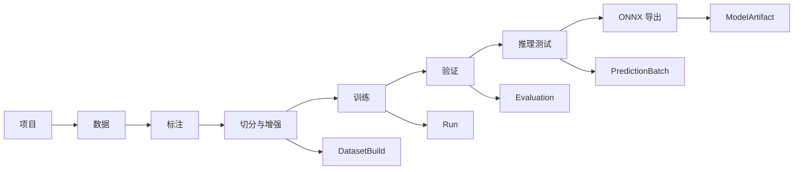
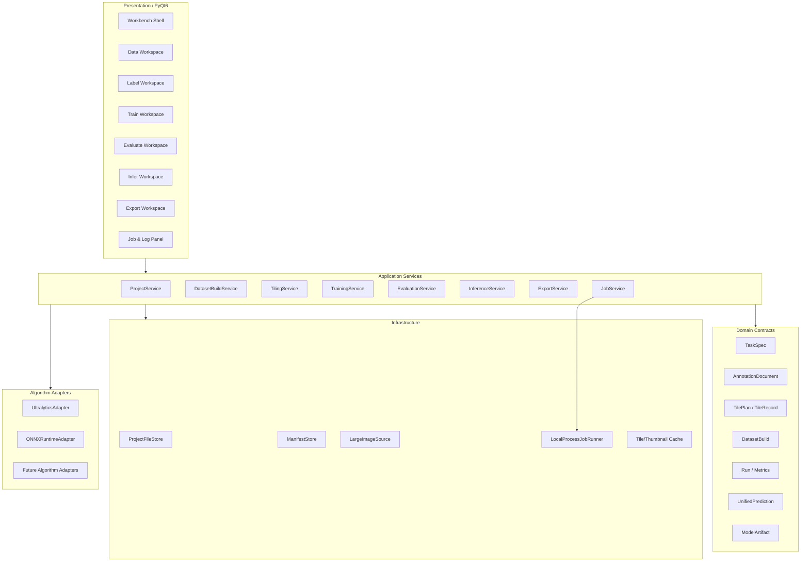
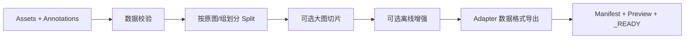

# 视觉算法离线桌面平台设计文档 V4.0 MVP Foundation

> 基于 X-AnyLabeling 的单机离线、多视觉任务、超大图切分训练验证一体化平台最小可落地方案

| 属性 | 内容 |
|---|---|
| 文档状态 | 技术总监评审后实施基线 |
| 版本 | V4.0 MVP Foundation |
| 日期 | 2026-06-06 |
| 工程基线 | 用户提供的 `X-AnyLabeling(1).zip`，主分支本地提交基线 |
| 前置文档 | `2026-06-06-vision-algorithm-platform-design-v3-offline-lite(1).md` |
| 部署形态 | Windows 11 单机离线桌面应用 |
| 技术基线 | Python 3.11+、PyQt6、Ultralytics、ONNX、OpenCV、Shapely |
| 核心目标 | 打通“数据导入—标注—大图切分—训练—指标—原图验证—ONNX 导出”最小闭环 |
| 核心原则 | 先完成稳定 MVP，内部接口按多任务、多算法、多增强方式设计，不提前建设数据库和远程平台 |

---

## 1. 技术总监结论

当前工程不需要推倒重写。X-AnyLabeling 已经具备较成熟的标注画布、标签格式转换、自动标注、Ultralytics 五类任务训练入口、训练子进程和多格式模型导出能力，适合作为桌面平台底座。

但当前工程仍然是“标注主窗口 + 大型训练对话框 + 若干算法服务”的组织方式，距离工业视觉开发平台还缺少四条真正的平台主线：

1. **超大图像的稳定显示、切分、标签切分和结果合并没有形成统一坐标闭环。**
2. **数据集构建不可复现。** 当前训练数据生成按时间创建临时目录，随机切分未固定 seed，也没有切片来源和数据清单。
3. **训练、验证、切片推理和导出仍是相对独立的功能。** 缺少一个模型从训练结果到原图验证再到 ONNX 的证据链。
4. **UI 与业务逻辑耦合过重。** `label_widget.py`、`canvas.py`、`ultralytics_dialog.py`、`model_manager.py` 已成为超大文件，后续增加任务或算法会显著提高回归风险。

因此，V4.0 不延续 V3.0 中完整模型注册、不可变对象仓库、复核队列、离线资源包、部署包和复杂修复系统的全部设计。V4.0 只保留对后续扩展最关键的架构地基：

- 文件化项目工作区；
- UI、应用服务、领域模型、算法适配器分层；
- 独立 Worker 执行长任务；
- 统一任务、标注、切片、预测和指标协议；
- Ultralytics 作为首个算法适配器，而不是平台核心；
- 大图原图坐标为唯一权威坐标；
- 数据增强分为样本级、批次级、数据集级三个扩展层级。

最终 MVP 应形成以下最短闭环：

```text
创建离线项目
  -> 导入普通图或超大图
  -> 基础标注
  -> 配置数据切分/大图切片
  -> 生成可复现训练数据集
  -> YOLO 本地训练
  -> 显示训练曲线和核心指标
  -> 在普通图或超大原图上验证
  -> 切片推理并合并到原图坐标
  -> 查看预测与标注差异
  -> 导出 ONNX 并执行一致性自检
```

---

## 2. 当前工程评审

### 2.1 可直接复用的能力

| 现有能力 | 评审结论 | V4.0 使用方式 |
|---|---|---|
| PyQt6 桌面框架 | 保留 | 增加工作台 Shell，不更换 UI 技术栈 |
| `LabelWidget` 标注主流程 | 保留并瘦身 | 作为 Label Workspace 的核心组件 |
| Rectangle、Rotation、Polygon、Point、Flags 等标注 | 直接复用 | 对应 Detect、OBB、Segment、Pose、Classify |
| `LabelConverter` | 复用但下沉 | 包装为 `AnnotationCodec`，禁止 Dataset 层依赖 View 层 |
| Ultralytics 五类任务 | 直接复用 | Classify、Detect、OBB、Segment、Pose |
| 训练子进程 | 保留并规范协议 | 接入统一 `JobRunner` 和结构化事件 |
| 训练参数与在线增强参数 | 保留 | 映射为 `UltralyticsTrainConfig` |
| `results.csv` 与训练产物 | 保留 | 由 Run 解析器生成统一指标模型 |
| 模型导出器 | 收缩范围 | MVP 只正式支持 ONNX |
| Camera2D / CoordinateMap | 重点复用 | 作为大图和小图统一坐标权威 |
| ImageProvider / TileCache / TileGrid 基础 | 重点复用 | 补齐生产接入、异步读取和多级图像源 |
| SAHI 自动标注能力 | 条件复用 | HBB 切片合并可借鉴；平台仍定义自己的统一合并接口 |

### 2.2 已验证的工程状态

本次对上传工程执行：

```text
python -m pytest tests/views/labeling -q
```

结果：

```text
100 passed, 20 skipped, 13 subtests passed
```

说明 Camera2D、CoordinateMap、Provider 契约和标注相关改造已经具有较好的自动化测试基础。但“测试存在”不等于“超大图能力已经生产启用”。

### 2.3 当前关键问题

#### P0：超大图生产路径被关闭

当前 `label_widget.py` 中：

```python
PROVIDER_THRESHOLD_MEGAPIXELS = 1_000_000  # disabled: use legacy pixmap path
```

这意味着普通 32,000 × 32,000 图像约为 1,024 MP，仍远低于该阈值，实际运行继续使用整图 QImage/QPixmap 路径。工程虽已有 `QImageRegionProvider`、Camera2D、TileCache 和测试，但默认产品路径未启用。

同时，`HugeImageCanvas` 是独立 pyqtgraph 实验组件，主要被测试脚本调用，并未成为现有 Shape 编辑链路的一部分。V4.0 不建议再维护两套 Canvas。应以当前 `Canvas + Camera2D + ImageProvider` 为唯一主路径，把 pyqtgraph 组件保留为实验代码或删除。

#### P0：没有大图训练数据切分与标签合并模块

当前项目有“显示用 tile 基础”，但没有完整的：

- `TilePlan`；
- 原图到切片图像的物化；
- HBB/OBB/Polygon/Pose 标签裁剪；
- 切片标注来源 ID；
- 切片预测恢复到原图坐标；
- 重叠区域去重；
- 切片标签回并；
- 原图级指标计算。

这是本次 MVP 最核心的新模块。

#### P0：训练数据构建不可复现

`create_yolo_dataset()` 当前使用随机打乱：

```python
valid_images = random.sample(valid_images, k=len(valid_images))
```

但未传入固定随机种子，也未保存样本分配清单。训练目录使用时间戳创建，无法准确回答某次训练使用了哪些原图、哪些切片、哪些标注版本。

此外，当前数据准备函数直接导入 View 层的 `LabelConverter`，违反后端与 UI 分层原则。

#### P1：训练 UI 过重

当前关键文件规模约为：

| 文件 | 规模 |
|---|---:|
| `views/labeling/label_widget.py` | 约 6,960 行 |
| `views/labeling/widgets/canvas.py` | 约 4,174 行 |
| `views/training/ultralytics_dialog.py` | 约 2,008 行 |
| `services/auto_labeling/model_manager.py` | 约 2,483 行 |

`UltralyticsDialog` 同时承担任务选择、数据检查、参数收集、数据集生成、训练启动、指标读取、训练图像显示和导出，后续增加第二种算法会复制大量 UI 和业务逻辑。

#### P1：训练指标显示不等于模型验证

当前 UI 能读取训练目录中的 `results.csv` 和训练图，但缺少统一的 Evaluation 对象。至少应区分：

- 训练过程指标；
- YOLO tile 验证集指标；
- 超大原图切片推理合并后的原图级指标；
- 单图可视化验证；
- PT 与 ONNX 输出一致性验证。

#### P1：数据增强接口被绑定在 Ultralytics 参数表中

当前已有 HSV、旋转、平移、缩放、错切、透视、多尺度、Mosaic 关闭轮次等参数，但这些只是 Ultralytics 训练参数。平台还缺少：

- 增强预览；
- 统一随机种子；
- 几何增强对标签同步变换；
- 数据集级增强作业；
- 非 YOLO 算法可复用的增强接口。

#### P1：离线约束未形成系统能力

`ModelManager` 仍包含模型下载、远程服务器和多种在线模型逻辑。MVP 可以保留原 X-AnyLabeling 功能，但平台项目模式必须显式开启 `offline_mode`，训练、验证、导出主流程不允许自动下载模型或自动安装依赖。

### 2.4 对 V3.0 文档的取舍

| V3.0 内容 | V4.0 决策 | V4.1 状态 |
|---|---|---|
| 模块化单体、Worker、Adapter、文件项目 | 保留 | - |
| 项目锁、原子写入、结构化任务日志 | 保留精简版 | - |
| Snapshot、DatasetVersion、SplitManifest 多层版本体系 | 简化为 `DatasetBuild + manifest` | - |
| 完整 Model Registry、Alias、Champion 状态 | 延后；MVP 只管理 Run 和 ModelArtifact | [V4.1 DEFERRED D-001] |
| ReviewQueue、误判回流状态机 | 延后；MVP 先做验证样本画廊和”转为标注”入口 | [V4.1 DEFERRED D-002] |
| Offline Resource Pack | 延后；先做依赖与本地模型预检 | [V4.1 DEFERRED D-003] |
| ExportPackage、自检包、许可证包 | 延后；MVP 只做 ONNX + 配置 + 一致性报告 | [V4.1 DEFERRED D-004] |
| 10 万资产、百万对象、复杂分片仓库 | 不作为首版设计目标 | [V4.1 DEFERRED D-005] |
| HBB SAHI | 可复用 | - |
| OBB/Mask/Pose 合并 | 平台自行实现任务专用 Merger | - |

V4.0 的目标不是削弱架构，而是减少首版对象数量和 UI 页面数量，让架构先围绕真实闭环运行起来。

---

## 3. 产品范围

### 3.1 MVP 必须实现

1. 单机离线项目创建、打开、保存和最近项目。
2. JPEG、PNG、BMP、TIFF 等本地图像导入。
3. 普通图与 32k 级超大图统一浏览和基础标注。
4. 大图按固定尺寸和重叠率切分。
5. HBB、OBB、实例分割 Polygon、Pose 标签切分。
6. 切片标签回并到原图坐标。
7. 可复现 train/val/test 数据切分。
8. YOLO Classify、Detect、OBB、Segment、Pose 训练。
9. 训练日志、进度、Loss、Precision、Recall、mAP 等指标显示。
10. 单图验证、目录验证和超大图切片验证。
11. 切片预测恢复与合并。
12. 预测结果叠加、筛选和基础错误查看。
13. PT 模型导出 ONNX。
14. ONNX 加载、自检和 PT/ONNX 一致性比较。
15. 样本级、批次级和数据集级增强接口；MVP 落地部分基础增强。
16. 算法 Adapter 接口；Ultralytics 为首个 Adapter。

### 3.2 MVP 明确不做（延后至 V4.1+）

> **[V4.1 DEFERRED]** 以下功能在 V4.0 MVP 中明确不做实现，但在 domain DTO 和接口中预留扩展位。
> 详见 `2026-06-06-vision-algorithm-platform-v4-mvp-contract.md` 第 3 节延后项清单。

- 数据库； <!-- V4.1 DEFERRED -->
- 用户、权限和团队协作； <!-- V4.1 DEFERRED -->
- 云端训练和远程推理； <!-- V4.1 DEFERRED -->
- 在线模型市场； <!-- V4.1 DEFERRED -->
- 自动超参数搜索； <!-- V4.1 DEFERRED D-009 -->
- 完整 MLOps 模型注册中心； <!-- V4.1 DEFERRED D-001 -->
- 可视化拖拽算法编排； <!-- V4.1 DEFERRED D-011 -->
- 实时产线推理服务； <!-- V4.1 DEFERRED -->
- TensorRT/OpenVINO 正式交付流程； <!-- V4.1 DEFERRED D-010 -->
- 复杂主动学习和自动误判队列； <!-- V4.1 DEFERRED D-002 -->
- 通用语义分割训练框架； <!-- V4.1 DEFERRED D-006 -->
- VLM、OCR、异常检测训练实现。 <!-- V4.1 DEFERRED D-007, D-013 -->

### 3.3 任务支持矩阵

| 任务 | 标注形态 | YOLO MVP | 大图标签切分 | 切片结果合并 | 后续扩展 |
|---|---|---:|---:|---:|---|
| 图像分类 | Image Flags | 是 | 默认不切；可按项目策略继承 | Tile Vote/Max/Average | 多标签分类 |
| HBB 检测 | Rectangle | 是 | 是 | Class-aware NMS/NMM/WBF | 非 YOLO 检测器 |
| OBB 检测 | Rotation | 是 | 是 | Polygon IoU NMS | 角度聚类、WBF |
| 实例分割 | Polygon | 是 | 是 | Mask/Polygon Merge | Raster Mask、语义分割 |
| 姿态 | Points + Skeleton | 是 | 是 | Box/OKS Merge | 多人姿态算法 |
| 语义分割 | Raster Mask | 仅预留 | 接口预留 | Logit/Mask Blend | Phase 2 |
| 异常检测 | Image/Mask | 仅预留 | 接口预留 | Heatmap Blend | PatchCore 等 |
| OCR/VLM | 专用 Schema | 仅预留 | 接口预留 | 专用 Merger | 独立 Adapter |

---

## 4. 用户主流程



### 4.1 最少操作路径

```text
新建项目
  -> 选择任务：实例分割
  -> 导入图像和类别
  -> 在原图上标注 Polygon
  -> 开启“大图切片”：1024 × 1024，重叠 20%
  -> 预览切片和标签裁剪
  -> 生成 DatasetBuild
  -> 选择 yolo11s-seg.pt
  -> 启动训练
  -> 查看曲线和最佳权重
  -> 对验证超大图执行切片验证
  -> 查看合并 Mask 与原始 GT 的指标
  -> 导出 best.onnx
  -> 执行固定样本一致性测试
```

---

## 5. 总体技术架构

### 5.1 架构形态

采用：

> **PyQt6 模块化单体 + 本地 Worker 子进程 + 文件化项目 + 算法 Adapter**

不引入本地 HTTP 服务。主进程负责 UI 和项目状态，长时间任务在独立进程执行。



### 5.2 分层约束

```text
Presentation -> Application -> Domain
Infrastructure / Adapters -> Application Ports + Domain DTO
Workers -> 稳定 Job Protocol
```

禁止：

```text
Domain 导入 PyQt
DatasetBuilder 导入 views.*
UI 直接写 project.json
Ultralytics 类型穿透到 UI ViewModel
Worker 修改其他 Job 或全局项目状态
ImageProvider 修改 Shape 原图坐标
```

### 5.3 为什么不是微服务

- 产品是单机离线桌面软件；
- 数据和模型均在本机；
- 首版团队规模有限；
- 微服务会增加部署、端口、协议、日志和版本兼容成本；
- 独立 Worker 已足够隔离训练崩溃和释放 GPU/内存。

### 5.4 为什么仍要 Adapter

Ultralytics 只应负责算法实现，不能定义平台的数据结构。通过 Adapter，后续可以加入：

- MMDetection；
- PaddleDetection；
- 自研 C++/CUDA 算法；
- PatchCore/Anomalib；
- OCR；
- 语义分割；
- ONNX/TensorRT 推理后端。

---

## 6. 文件化项目结构

### 6.1 MVP 目录

```text
<project_root>/
  project.json
  labels.json

  assets/
    assets.jsonl
    thumbnails/

  annotations/
    <asset_id>.json

  dataset_builds/
    <build_id>/
      build.json
      split_manifest.jsonl
      tile_manifest.jsonl
      data.yaml
      images/
        train/
        val/
        test/
      labels/
        train/
        val/
        test/
      preview/
      _READY

  jobs/
    <job_id>/
      request.json
      state.json
      events.jsonl
      stdout.log
      stderr.log
      result.json

  runs/
    <run_id>/
      run.json
      train_config.yaml
      environment.json
      metrics.jsonl
      artifacts/
      _READY

  evaluations/
    <evaluation_id>/
      evaluation.json
      metrics.json
      predictions.jsonl
      samples/
      _READY

  models/
    <model_id>/
      model.json
      best.pt
      best.onnx
      labels.json
      preprocess.json
      postprocess.json
      onnx_check.json
      _READY

  cache/
    tiles/
    thumbnails/
    indexes/

  logs/
```

### 6.2 简化原则

- 不建立独立 Snapshot UI。
- 每次训练引用一个固定 `DatasetBuild`。
- `DatasetBuild` 创建后不可原地修改；参数变化则创建新 Build。
- Run 只引用 Build ID、基础模型哈希和训练参数。
- ModelArtifact 从 Run 产物生成。
- 缓存可删除，权威数据不可依赖缓存。

### 6.3 原子写入

小型 JSON 使用：

```text
写入 target.tmp
  -> flush
  -> 重新解析校验
  -> os.replace(target.tmp, target)
```

复杂目录只有存在 `_READY` 才能在 UI 中显示为可用。

---

## 7. 核心数据协议

### 7.1 TaskSpec

```python
@dataclass(frozen=True)
class TaskSpec:
    id: str
    family: Literal[
        "classification",
        "detection_hbb",
        "detection_obb",
        "instance_segmentation",
        "pose",
        "semantic_segmentation",
        "anomaly",
    ]
    labels: tuple[LabelClass, ...]
    annotation_schema: str
    primary_metric: str
```

### 7.2 Asset

```python
@dataclass(frozen=True)
class Asset:
    id: str
    path: str
    width: int
    height: int
    channels: int | None
    bit_depth: int | None
    group_id: str | None
    sha256: str | None
```

### 7.3 AnnotationDocument

平台内部统一使用原图像素坐标：

```python
@dataclass
class AnnotationDocument:
    asset_id: str
    image_width: int
    image_height: int
    objects: list[AnnotationObject]
    image_labels: dict[str, bool]
```

```python
@dataclass
class AnnotationObject:
    id: str
    label_id: int
    geometry_type: Literal[
        "bbox_xyxy", "polygon", "obb_polygon", "keypoints", "raster_mask"
    ]
    geometry: object
    attributes: dict
    source_object_id: str | None = None
```

X-AnyLabeling JSON 和 YOLO TXT 都是外部格式，由 Codec 转换，不作为领域核心类型。

### 7.4 TilePlan 与 TileRecord

```python
@dataclass(frozen=True)
class TilePlan:
    tile_width: int
    tile_height: int
    overlap_x: int
    overlap_y: int
    edge_mode: Literal["crop", "pad"]
    padding_value: int | tuple[int, ...]
    min_object_pixels: int
    min_visibility_ratio: float
```

```python
@dataclass(frozen=True)
class TileRecord:
    tile_id: str
    asset_id: str
    x0: int
    y0: int
    width: int
    height: int
    valid_width: int
    valid_height: int
    split: Literal["train", "val", "test", "none"]
```

### 7.5 DatasetBuild

```python
@dataclass(frozen=True)
class DatasetBuild:
    id: str
    task_spec_id: str
    source_asset_manifest_hash: str
    annotation_manifest_hash: str
    split_seed: int
    split_strategy: str
    tile_plan: TilePlan | None
    augmentation_plan_id: str | None
    adapter_id: str
    output_path: str
```

### 7.6 UnifiedPrediction

所有算法预测必须恢复为原图坐标：

```python
@dataclass
class UnifiedPrediction:
    asset_id: str
    task_family: str
    model_id: str
    objects: list[PredictionObject]
    source_tile_ids: list[str]
    elapsed_ms: float
```

---

## 8. 超大图像显示架构

### 8.1 核心决策

保留现有 `Canvas`，以 `Camera2D + CoordinateMap` 为唯一视图状态和坐标转换来源。启用并完善 `ImageProvider`，不将 `HugeImageCanvas` 发展为第二套标注画布。

```text
图像原始坐标 L0
  -> Camera2D.visible_rect
  -> ImageSource.read_region()
  -> Resolution Level Selection
  -> Tile/Region Cache
  -> Viewport Paint

Shape.points 始终存储 L0 坐标
```

### 8.2 ImageSource 接口

```python
class LargeImageSource(Protocol):
    def metadata(self) -> ImageMetadata: ...
    def read_region(
        self,
        rect_l0: RectI,
        output_size: SizeI,
        level_hint: int | None = None,
    ) -> ImageRegion: ...
    def read_pixel(self, x: int, y: int) -> PixelValue: ...
```

首版实现：

1. `QtImageSource`：普通图和支持 ROI 解码的格式。
2. `TiffImageSource`：大 TIFF、分块 TIFF、金字塔 TIFF。
3. `MemoryImageSource`：已在内存中的普通图。

`QImageReader.setClipRect()` 是否真正按 ROI 解码取决于具体 codec。必须在 Preflight 中检测，不能假设所有 TIFF/PNG/JPEG 都具备相同随机读取性能。

### 8.3 渲染策略

- 小图也使用 Camera2D，避免两套坐标公式。
- 大图阈值改为可配置，默认建议 `64 MP` 或按估算内存触发。
- 缩小显示优先使用金字塔低分辨率级别。
- 放大到像素级时使用 L0 最近邻显示，可显示像素网格。
- 图像采样和 Shape 绘制分层；Shape 不进入 tile cache。
- Tile 读取在后台线程池执行。
- 每次视图变化生成 `view_revision`，过期请求结果直接丢弃。
- UI 的缩放和平移状态更新必须立即完成，不等待磁盘读取。
- TileCache 使用字节上限，不按条数上限。

### 8.4 当前代码改造点

```text
label_widget.py
  - 恢复合理 PROVIDER_THRESHOLD_MEGAPIXELS
  - 把大图加载逻辑移入 ImageOpenService
  - 禁止大图功能再次触发全图 QImage 解码

canvas.py
  - 保留交互和 Shape 绘制
  - provider 渲染下沉到 ViewportRenderer
  - 移除对 provider 私有字段 _pyramid 的直接访问

viewport/image_provider.py
  - 拆为 LargeImageSource + Codec-specific Source
  - 增加异步请求、level、错误和能力声明

huge_image_canvas.py
  - 标记 experimental，不接入主产品链路
```

---

## 9. 大图切分、标签切分与合并

### 9.1 四个能力必须分离

| 能力 | 是否生成切片文件 | 使用场景 |
|---|---:|---|
| 显示 Tile | 否 | 视口渲染 |
| 训练数据切片 | 是 | 生成 YOLO 数据集 |
| 推理切片 | 默认否 | 运行时按 ROI 读取并推理 |
| 结果合并 | 否 | 恢复原图预测和标签 |

显示 Tile 不可直接当训练 Tile 使用，两者缓存和生命周期不同。

### 9.2 切片生成规则

```python
stride_x = tile_width - overlap_x
stride_y = tile_height - overlap_y
```

边界支持：

- `crop`：最后一个切片尺寸可变；
- `pad`：保持固定输入尺寸，并记录 `valid_width/valid_height`。

MVP 默认：

```text
tile = 1024 × 1024
重叠 = 20%
边界 = pad
```

UI 必须提供切片预览，显示：

- 切片网格；
- 每张切片对象数量；
- 被边界裁剪对象；
- 被过滤的小对象；
- 空切片比例；
- 预计磁盘占用。

### 9.3 数据集切分顺序

必须先按原图或业务组划分 train/val/test，再对每组内部切片：

```text
原图/晶圆/批次分组
  -> train/val/test
  -> 各 split 内生成 tiles
```

禁止先切片再随机划分，否则同一原图相邻区域会进入不同集合，形成严重数据泄漏。

### 9.4 HBB 标签切分

1. 计算 bbox 与 tile 有效区域交集。
2. 交集为空则忽略。
3. 计算：

```text
visibility_ratio = intersection_area / original_bbox_area
```

4. 训练模式按 `min_object_pixels` 和 `min_visibility_ratio` 过滤。
5. 坐标减去 tile 原点。
6. 保存 `source_object_id`。

### 9.5 OBB 标签切分

OBB 不应直接对角点做简单 clamp。流程：

```text
OBB 四边形
  -> 与 tile 矩形执行 polygon intersection
  -> 过滤小面积碎片
  -> 保留裁剪 polygon
  -> 导出 YOLO OBB 时再转换为四点或最小外接旋转矩形
```

必须记录是否发生几何降级：

```json
{"geometry_degraded": true, "reason": "clipped_polygon_to_min_area_rect"}
```

### 9.6 实例分割标签切分

- 使用 polygon 与 tile 有效区域求交；
- MultiPolygon 可以：
  - 默认拆成多个 fragment，保持同一 `source_object_id`；
  - 或仅保留最大 fragment，由任务配置决定；
- 过滤小面积 fragment；
- 坐标平移到 tile 局部坐标；
- 不把密集 Mask 轮廓无上限写入 JSON。

### 9.7 Pose 标签切分

- 以实例 bbox 或可见关键点范围判断是否进入 tile；
- 关键点坐标平移；
- tile 外关键点标记不可见；
- 可见关键点不足阈值时丢弃该实例；
- 保留原实例 ID。

### 9.8 分类标签策略

分类任务默认对整图训练，不自动切片。若用户启用分类切片：

- `inherit`：所有 tile 继承原图类别；
- `roi_only`：只对显式 ROI 内 tile 继承；
- `aggregation`：推理时通过 max、mean、top-k vote 聚合。

项目必须明确策略，避免无意义背景 tile 被赋予缺陷类。

### 9.9 标签回并的两种模式

#### 模式 A：可逆工程回并

用于验证切分正确性：

- 切分时保留全部非空 fragment；
- 不执行训练过滤；
- 按 `source_object_id` 分组；
- 坐标加回 tile 原点；
- Polygon 做 union；
- HBB/OBB 使用原对象几何或 fragment union 重建。

目标：

```text
原标注 -> 切片标签 -> 合并标签
```

在允许的浮点误差范围内与原标注一致。

#### 模式 B：训练/推理回并

用于真实模型预测或经过人工修改的 tile 标签：

- 有 `source_object_id` 时优先按来源合并；
- 无来源 ID 时按类别、重叠和边界关系聚类；
- 使用任务专用 Merger；
- 输出冲突和去重报告。

### 9.10 预测合并策略

| 任务 | MVP 合并器 |
|---|---|
| HBB | Class-aware NMS，提供 NMM/WBF 扩展位 |
| OBB | Polygon IoU NMS |
| Instance Seg | BBox 候选聚类 + Mask/Polygon IoU + Union/保留高分实例 |
| Pose | BBox IoU + OKS 或关键点距离 |
| Classification | Tile score aggregation |
| Semantic Seg | 预留 weighted overlap blend |
| Anomaly Heatmap | 预留 window weight blend |

### 9.11 Tile Manifest

```json
{
  "tile_id": "tile_asset001_0003_0007",
  "asset_id": "asset001",
  "source_path": "assets/wafer001.tif",
  "x0": 2457,
  "y0": 5733,
  "width": 1024,
  "height": 1024,
  "valid_width": 1024,
  "valid_height": 1024,
  "split": "train",
  "objects_before": 7,
  "objects_after": 5,
  "filtered_object_ids": ["obj12", "obj15"]
}
```

---

## 10. 基础标注能力

### 10.1 MVP 标注工具

- 图像级分类 Flags；
- Rectangle；
- Rotated Rectangle；
- Polygon；
- Point/Keypoint；
- 删除、复制、移动、顶点编辑；
- 类别和属性；
- checked 状态；
- 自动保存；
- 标注显隐；
- 预测结果转标注；
- 普通图与大图一致的坐标保存。

Raster Mask Brush 不作为 V4.0 MVP 的阻塞项，但应保留 `raster_mask` geometry 类型和 Overlay 接口，后续不能再把稠密画笔结果强制转为超密 Polygon。

### 10.2 标注 UI 与后端边界

```text
Canvas 产生 AnnotationCommand
  -> AnnotationService 校验
  -> AnnotationDocument 更新
  -> XLabelCodec 保存 JSON
```

Canvas 不直接了解 DatasetBuild、YOLO TXT 或 Run。

### 10.3 标注校验

保存前至少检查：

- 标签是否存在；
- Shape 是否与任务兼容；
- 坐标是否有限数；
- 是否超出原图边界；
- Polygon 是否自交；
- OBB 点数和顺序；
- Pose 点数是否与 skeleton 配置一致。

---

## 11. 数据集构建与增强架构

### 11.1 DatasetBuild 流程



### 11.2 Split 策略

MVP 支持：

- Random by Asset；
- Group by `group_id`；
- Manual；
- Train/Val/Test 比例；
- 固定 seed。

必须检查：

- 同一原图切片不得跨 split；
- 相同文件哈希不得跨 split；
- 同一 group 不得跨 split；
- 空标注样本是否按策略保留；
- 类别在各 split 的分布。

### 11.3 增强分层

```text
SampleAugmentation
  单图输入，单图输出
  例：亮度、对比度、Gamma、噪声、模糊、旋转、翻转

BatchAugmentation
  多样本输入，单样本或多样本输出
  例：Mosaic、MixUp、Copy-Paste

DatasetAugmentation
  对数据集做采样、复制、合成或离线物化
  例：类别过采样、背景合成、缺陷贴图、hard-negative 注入
```

### 11.4 通用增强接口

```python
class AugmentationOp(Protocol):
    id: str
    scope: Literal["sample", "batch", "dataset"]

    def validate(self, task: TaskSpec) -> ValidationResult: ...
    def apply(self, context: AugmentationContext) -> AugmentationResult: ...
    def serialize_config(self) -> dict: ...
```

`AugmentationResult` 必须同时返回图像和同步变换后的 AnnotationDocument。

### 11.5 几何增强约束

几何增强必须输出变换矩阵或可组合几何映射：

```python
@dataclass
class GeometryTransform:
    forward: np.ndarray
    inverse: np.ndarray | None
    output_width: int
    output_height: int
```

HBB、OBB、Polygon、Keypoints 分别由 GeometryMapper 处理。禁止每个增强算子重复实现一套标签变换代码。

### 11.6 MVP 实现范围

#### 直接使用 Ultralytics 在线增强

- HSV；
- degrees；
- translate；
- scale；
- shear；
- perspective；
- multi-scale；
- Mosaic/MixUp/Copy-Paste 等框架支持项。

#### 平台离线增强首版

- Horizontal/Vertical Flip；
- 90° Rotation；
- Brightness/Contrast；
- Gamma；
- Gaussian Noise；
- Blur；
- 类别过采样；
- 增强预览和固定 seed。

其余只注册能力，不在 MVP 中一次性实现。

### 11.7 增强预览

Data Workspace 中选择 1～16 张样本，显示：

```text
原图 | 增强图 | 原标签 | 变换后标签 | 随机参数
```

用户确认后才能保存为 AugmentationPlan。

---

## 12. 算法插件与 Ultralytics Adapter

### 12.1 统一接口

```python
class VisionAlgorithmAdapter(Protocol):
    adapter_id: str

    def capabilities(self) -> AlgorithmCapabilities: ...
    def prepare_dataset(self, request: PrepareDatasetRequest) -> PreparedDataset: ...
    def preflight_train(self, request: TrainRequest) -> PreflightReport: ...
    def build_train_command(self, request: TrainRequest) -> WorkerCommand: ...
    def parse_run(self, run_dir: Path) -> RunResult: ...
    def predict(self, request: PredictRequest) -> Iterable[UnifiedPrediction]: ...
    def evaluate(self, request: EvaluateRequest) -> EvaluationResult: ...
    def export(self, request: ExportRequest) -> ModelArtifact: ...
```

### 12.2 能力声明

```python
@dataclass(frozen=True)
class AlgorithmCapabilities:
    task_families: frozenset[str]
    supports_training: bool
    supports_validation: bool
    supports_export_onnx: bool
    supports_sliced_inference: frozenset[str]
    supported_annotation_schemas: frozenset[str]
```

UI 只根据能力声明启用按钮，不能通过 `if algorithm == "yolo"` 到处硬编码。

### 12.3 UltralyticsAdapter 拆分

```text
UltralyticsDatasetAdapter
UltralyticsTrainAdapter
UltralyticsRunParser
UltralyticsPredictAdapter
UltralyticsEvaluateAdapter
UltralyticsOnnxExporter
```

这样未来添加新算法时可以只替换所需能力，而不是继承一个巨型类。

---

## 13. 本地 Job 与 Worker

### 13.1 长任务范围

- 资产扫描和哈希；
- 大图训练切片；
- 标签裁剪；
- 数据集构建；
- 离线增强；
- 训练；
- 验证；
- 批量/切片推理；
- ONNX 导出和一致性测试。

### 13.2 状态机

```text
QUEUED -> STARTING -> RUNNING -> SUCCEEDED
                         |         |
                         v         v
                    CANCELING    FAILED
                         |
                         v
                      CANCELED
```

### 13.3 Worker 事件

```jsonl
{"seq":1,"type":"started","payload":{"pid":1234}}
{"seq":2,"type":"progress","payload":{"current":32,"total":100}}
{"seq":3,"type":"metric","payload":{"name":"metrics/mAP50(B)","value":0.74,"step":12}}
{"seq":4,"type":"artifact","payload":{"kind":"best_pt","path":"weights/best.pt"}}
{"seq":5,"type":"completed","payload":{}}
```

### 13.4 UI 更新

- UI 通过 Job ViewModel 订阅事件；
- 训练日志不直接重定向全局 stdout；
- 高频 batch 日志合并；
- 曲线按 epoch 更新；
- 关闭窗口不直接杀死主程序；
- 支持 stop.flag 和进程树终止。

---

## 14. 训练功能

### 14.1 训练配置分层

```text
Basic
  Task、DatasetBuild、Base Model、Epoch、Image Size、Batch、Device

Optimization
  Optimizer、LR、Scheduler、Patience、AMP、Workers

Augmentation
  使用 AugmentationPlan 或 Ultralytics 在线增强参数

Advanced
  Loss 权重、冻结层、Resume、Save Period
```

UI 默认只展示 Basic。高级参数折叠，避免 AIDI 式平台被做成参数堆叠器。

### 14.2 训练前置检查

- DatasetBuild `_READY`；
- 任务与算法能力匹配；
- 基础模型本地存在；
- 不允许 URL 模型引用；
- CUDA/CPU 设备存在；
- 磁盘空间；
- 类别数量与模型任务；
- Pose 配置；
- 图像/标签数量；
- 空标签策略；
- 数据泄漏检查通过。

### 14.3 Run 记录

```json
{
  "run_id": "run_20260606_001",
  "adapter_id": "ultralytics.v1",
  "task_family": "instance_segmentation",
  "dataset_build_id": "build_001",
  "base_model": "D:/models/yolo11s-seg.pt",
  "base_model_sha256": "...",
  "config": {},
  "environment": {},
  "status": "SUCCEEDED",
  "best_metric": {"name": "mask_map50_95", "value": 0.62}
}
```

---

## 15. 指标显示和模型验证

### 15.1 Train Workspace 显示

- Epoch/总 Epoch；
- 当前状态和剩余时间；
- Train/Val Loss；
- Precision、Recall；
- mAP50、mAP50-95；
- GPU 显存和利用率；
- 最佳 Epoch；
- 最佳权重路径；
- 可滚动日志。

### 15.2 Evaluation 的两个层级

#### A. Tile-native Validation

直接调用 Ultralytics Val，在训练切片验证集上计算框架指标。优点是快速、与训练框架一致。

#### B. Original-merged Validation

```text
验证原图
  -> 按 TilePlan 虚拟切片
  -> 模型推理
  -> 恢复原图坐标
  -> 任务专用合并
  -> 与原图 GT 比较
  -> 输出原图级指标
```

这是超大图工业场景必须具备的验证模式。Tile 指标高并不代表跨 tile 大目标、边界目标和重复预测处理正确。

### 15.3 任务指标

| 任务 | MVP 指标 |
|---|---|
| 分类 | Accuracy、Macro Precision/Recall/F1、Confusion Matrix |
| HBB | mAP50-95、mAP50、Precision、Recall、FP/Image |
| OBB | OBB mAP、中心误差、角度误差 |
| 实例分割 | Mask mAP、IoU、Dice、Boundary IoU 可选 |
| Pose | OKS mAP、PCK 可选 |

### 15.4 验证样本画廊

支持筛选：

- TP、FP、FN；
- 低置信度；
- 大图 tile 边界目标；
- 小目标；
- 类别；
- 原图；
- 最差 IoU；
- 推理失败。

点击样本进入 Label Workspace，显示 GT 与 Prediction 双层 Overlay，并提供“复制预测为标注”操作。首版不建设完整 ReviewQueue 状态机。

---

## 16. 切片推理验证

### 16.1 推理输入

- 项目数据集；
- 指定图片；
- 指定目录；
- 当前打开图像；
- 超大图原图。

### 16.2 推理策略

```python
@dataclass(frozen=True)
class SlicedInferenceConfig:
    tile_plan: TilePlan
    batch_size: int
    score_threshold: float
    merger_id: str
    merger_config: dict
```

### 16.3 虚拟切片

推理默认不写切片图片：

```text
LargeImageSource.read_region(tile_rect)
  -> ndarray
  -> preprocess
  -> batch inference
  -> tile-local prediction
  -> original-coordinate prediction
  -> merge
```

只有用户选择“导出调试切片”时才物化切片文件。

### 16.4 可视化

Infer Workspace 显示：

- 原图；
- 切片网格；
- 当前 tile；
- 合并前预测；
- 合并后预测；
- 重叠去重连线或来源 tile；
- 置信度阈值；
- Merger 参数；
- 总耗时、切片耗时、推理耗时、合并耗时。

---

## 17. ONNX 导出

### 17.1 MVP 正式支持范围

只正式支持 ONNX，其他格式保留原有入口但不纳入平台 MVP 验收。

### 17.2 导出流程

```text
选择 Run/best.pt
  -> 环境预检
  -> Ultralytics ONNX Export
  -> ONNX Checker
  -> ONNX Runtime 加载
  -> 固定样本推理
  -> PT/ONNX 输出比较
  -> 生成 ModelArtifact
```

### 17.3 导出配置

- imgsz；
- dynamic；
- simplify；
- opset；
- half；
- batch；
- NMS 是否内置；
- 任务后处理配置。

### 17.4 一致性自检

至少选择 5～20 张固定样本：

- 分类：logit 或概率差；
- HBB/OBB：匹配后 box/score 差；
- Segment：mask IoU 和 score 差；
- Pose：keypoint 坐标差。

输出：

```json
{
  "load_ok": true,
  "output_schema_ok": true,
  "samples": 10,
  "max_abs_error": 0.00031,
  "prediction_match_rate": 1.0,
  "passed": true
}
```

---

## 18. UI 信息架构

### 18.1 参考原则

参考 AIDI 页面呈现的工业视觉开发流程：图像输入、算法模块、数据标注、模型训练、验证测试、分析优化和模型导出。其截图表现出深色工作台、顶部流程导航、中央图像画布、右侧标签/参数面板、训练曲线与混淆矩阵等信息组织方式。

V4.0 借鉴其**流程清晰、模块卡片、中央画布、右侧属性栏、训练与验证可视化**，但不照搬视觉样式和复杂“算法画布”。MVP 以固定工作流为主，避免首版引入通用节点编排。

### 18.2 Workbench Shell

```text
┌──────────────────────────────────────────────────────────────┐
│ 菜单 / 项目名称 / 离线状态 / 设备 / 当前任务                │
├──────────────────────────────────────────────────────────────┤
│ 数据  →  标注  →  切分增强  →  训练  →  验证  →  推理  → 导出 │
├──────────────┬────────────────────────────┬──────────────────┤
│ 项目/文件树  │                            │ 属性/参数/标签    │
│ 数据集列表   │       主工作区域           │ 当前对象信息      │
│ Run 列表     │  Canvas / Curve / Gallery  │ 阈值与配置        │
│ Model 列表   │                            │                  │
├──────────────┴────────────────────────────┴──────────────────┤
│ Job 状态 / Progress / Logs / Errors                         │
└──────────────────────────────────────────────────────────────┘
```

### 18.3 页面规划

#### 18.3.1 Project Home

- 新建/打开项目；
- 最近项目；
- 项目摘要；
- 当前任务；
- 数据量、已标注量；
- 最近 Run；
- 当前模型；
- 环境状态。

#### 18.3.2 Data Workspace

左侧：资产目录和筛选。

中央：缩略图网格/列表。

右侧：

- 图像信息；
- 类别分布；
- 标注覆盖率；
- train/val/test 设置；
- 大图切片设置；
- 增强设置；
- DatasetBuild 预览与创建。

#### 18.3.3 Label Workspace

复用现有 X-AnyLabeling 布局：

- 左侧工具栏；
- 中央 Canvas；
- 右侧标签与 Shape 列表；
- 顶部图像与标注操作；
- 底部坐标、缩放和像素值。

平台 Shell 只注入 ProjectContext，不重写所有标注交互。

#### 18.3.4 Train Workspace

左侧：

- Task；
- DatasetBuild；
- Algorithm；
- Base Model；
- 基础参数；
- 增强方案。

中央：

- Run 状态；
- Loss/Metric 曲线；
- 训练图像；
- GPU 信息。

右侧：

- 当前最佳指标；
- 产物；
- Warning；
- Stop/Resume；
- 前往验证。

#### 18.3.5 Evaluate Workspace

- Tile Validation / Original Merged 两种模式；
- 指标卡；
- Confusion Matrix；
- PR/F1 曲线；
- 类别表；
- 错误样本画廊；
- GT/Prediction Overlay。

#### 18.3.6 Infer Workspace

- 选择模型和输入；
- 普通/切片推理切换；
- TilePlan；
- 阈值和 Merger；
- 原图结果；
- 性能分解；
- 导出预测或转标注。

#### 18.3.7 Export Workspace

- 选择 Run/Model；
- ONNX 参数；
- 环境预检；
- 导出进度；
- 一致性报告；
- 输出目录。

### 18.4 UI 技术设计

```text
WorkbenchWindow
  QStackedWidget / page router
  NavigationBar
  ProjectExplorerDock
  InspectorDock
  JobConsoleDock
```

列表和表格使用 Qt Model/View：

- `QAbstractListModel` 管理资产列表；
- `QAbstractTableModel` 管理 Run、Metric、Prediction；
- ProxyModel 负责筛选排序；
- 禁止用大量 QWidget 行堆叠十万条数据；
- ViewModel 订阅应用服务事件，不直接扫描磁盘。

### 18.5 UI 状态规则

- 页面切换不销毁正在运行 Job；
- 每个页面只显示当前上下文可用操作；
- 未选择 DatasetBuild 时禁用训练；
- 未完成 Run 时禁用正式导出；
- 超大图正在读取 tile 时 Canvas 仍可缩放和平移；
- 错误提示同时提供用户说明、技术详情和日志路径；
- 持续显示“离线模式”。

---

## 19. 代码目录规划

### 19.1 新增平台目录

```text
anylabeling/platform/
  domain/
    task.py
    asset.py
    annotation.py
    tile.py
    dataset.py
    run.py
    prediction.py
    model.py

  application/
    project_service.py
    annotation_service.py
    dataset_build_service.py
    tiling_service.py
    training_service.py
    evaluation_service.py
    inference_service.py
    export_service.py
    job_service.py
    dto.py
    ports.py

  infrastructure/
    project_file_store.py
    manifest_store.py
    atomic_writer.py
    checksum.py
    process_job_runner.py
    image_sources/
      base.py
      qt_image_source.py
      tiff_image_source.py
    cache/
      tile_cache.py
      thumbnail_cache.py

  tiling/
    tile_planner.py
    image_tiler.py
    label_splitters/
      hbb.py
      obb.py
      polygon.py
      pose.py
      classify.py
    mergers/
      hbb_nms.py
      obb_nms.py
      instance_mask.py
      pose.py
      classification.py

  augmentation/
    base.py
    pipeline.py
    geometry_mapper.py
    sample_ops/
    batch_ops/
    dataset_ops/

  adapters/
    ultralytics/
      capabilities.py
      dataset_adapter.py
      train_adapter.py
      run_parser.py
      predict_adapter.py
      evaluate_adapter.py
      onnx_exporter.py
    onnxruntime/
      predictor.py

  workers/
    worker_main.py
    protocol.py
    handlers/

anylabeling/views/platform/
  workbench_window.py
  navigation_bar.py
  project_home.py
  data_workspace.py
  train_workspace.py
  evaluate_workspace.py
  infer_workspace.py
  export_workspace.py
  job_console.py
  view_models/
```

### 19.2 现有文件改造

#### `label_widget.py`

- 保留标注编排；
- 注入 `ProjectContext` 和 `AnnotationService`；
- 大图打开调用 `ImageOpenService`；
- 预测转标注调用 Application Service；
- 新平台菜单只负责打开 Workbench；
- 逐步拆出文件、导航器、标注保存和自动标注控制器。

#### `canvas.py`

- 保留 Shape 交互；
- Camera2D 是唯一坐标状态；
- provider 渲染下沉；
- 所有图像尺寸查询统一走 `ImageGeometry`；
- 修复仍依赖 `pixmap.width()` 的大图编辑逻辑；
- 增加大图模式专项回归测试。

#### `auto_training/ultralytics/general.py`

- 停止直接被新 UI 调用；
- 逻辑迁移到 `UltralyticsDatasetAdapter`；
- 固定 seed；
- 输入改为 DatasetBuild；
- 输出 manifest；
- 不导入 View 层。

#### `auto_training/ultralytics/trainer.py`

- 复用底层启动逻辑；
- 对接统一 Worker 协议；
- 结构化 metric/artifact 事件；
- 支持 job_id、stop.flag、result.json。

#### `training/ultralytics_dialog.py`

- 保留为兼容入口；
- 新项目模式逐步迁移到 Train Workspace；
- 不再直接生成正式数据集和管理 ModelArtifact。

#### `auto_training/ultralytics/exporter.py`

- 拆出 preflight；
- MVP 平台路径只暴露 ONNX；
- 禁止自动安装依赖；
- 增加 ONNX 自检。

#### `model_manager.py`

- 平台离线模式下只允许本地模型；
- 自动标注注册由 ModelArtifact 生成本地配置；
- 远程模型功能与平台项目模式隔离。

---

## 20. 关键接口示例

### 20.1 LabelSplitter

```python
class LabelSplitter(Protocol):
    task_family: str

    def split(
        self,
        annotations: AnnotationDocument,
        tile: TileRecord,
        policy: LabelSplitPolicy,
    ) -> list[AnnotationObject]: ...
```

### 20.2 PredictionMerger

```python
class PredictionMerger(Protocol):
    task_family: str

    def merge(
        self,
        predictions: Iterable[TilePrediction],
        image_size: SizeI,
        config: MergeConfig,
    ) -> UnifiedPrediction: ...
```

### 20.3 Evaluator

```python
class TaskEvaluator(Protocol):
    task_family: str

    def evaluate(
        self,
        ground_truth: Iterable[AnnotationDocument],
        predictions: Iterable[UnifiedPrediction],
        config: EvaluationConfig,
    ) -> EvaluationResult: ...
```

### 20.4 JobHandler

```python
class JobHandler(Protocol):
    job_kind: str

    def run(
        self,
        request: dict,
        reporter: JobReporter,
        cancellation: CancellationToken,
    ) -> dict: ...
```

---

## 21. 实施计划

### Phase 0：平台地基与 UI Shell

周期：1.5～2 周。

范围：

- `anylabeling/platform` 基础目录；
- Domain DTO；
- ProjectFileStore；
- AtomicWriter；
- Job 协议；
- Workbench Shell；
- Project Home；
- 兼容现有 LabelWidget；
- 离线模式开关。

完成条件：

- 可创建/打开项目；
- 可在 Workbench 中打开 Label Workspace；
- Job 可启动、显示进度、取消和记录日志；
- UI 不直接写项目文件。

### Phase 1：超大图、切分与数据集构建

周期：2.5～3.5 周。

范围：

- 启用生产 ImageProvider；
- TiffImageSource；
- 异步 Region/Tile 读取；
- TilePlan；
- HBB/OBB/Polygon/Pose 切分；
- 可逆标签回并；
- 固定 Split；
- DatasetBuild；
- Data Workspace 与切片预览。

完成条件：

- 32k 图像不整图解码即可打开和标注；
- 原标注切分并回并的几何误差满足验收；
- 同一原图 tile 不跨 split；
- 相同配置和 seed 生成相同 manifest。

### Phase 2：训练、指标和模型管理

周期：2～3 周。

范围：

- Ultralytics Adapter；
- Train Workspace；
- Run；
- 训练指标解析；
- 基础增强计划；
- 本地模型预检；
- 最佳权重管理。

完成条件：

- 五类 YOLO 任务可从 DatasetBuild 启动；
- 训练 UI 可显示进度、曲线、日志和最佳模型；
- Run 可重开查看；
- 训练不访问网络。

### Phase 3：验证、切片推理与 ONNX

周期：2～3 周。

范围：

- Evaluate Workspace；
- Tile-native 和 Original-merged 两类验证；
- HBB/OBB/Segment/Pose Merger；
- 错误样本画廊；
- Infer Workspace；
- ONNX 导出和一致性测试。

完成条件：

- 超大图可完成虚拟切片推理和原图结果合并；
- 指标可追溯到 Run、DatasetBuild 和 TilePlan；
- ONNX 能加载并通过固定样本自检。

### Phase 4：稳定性与发布

周期：1.5～2 周。

范围：

- 大图压力测试；
- 崩溃和取消测试；
- Windows 打包；
- 中文路径和长路径；
- CPU/GPU 环境；
- 文档与示例项目；
- 性能分析和缺陷修复。

### 21.1 人员与工期建议

建议 3～4 人并行：

| 角色 | 主要职责 |
|---|---|
| 架构/后端工程师 | Project、Job、Domain、Adapter、Run |
| 大图/几何工程师 | ImageSource、Tile、Label Split/Merge、性能 |
| PyQt 工程师 | Workbench、Data/Train/Evaluate/Infer UI |
| 算法/测试工程师 | YOLO 适配、指标、ONNX、自测数据和验收 |

在接口先冻结、任务并行良好的情况下，MVP 预计 **8～11 周**。若只有 2 名工程师，建议按 **13～17 周** 评估。

### 21.2 代码量估计

| 模块 | 生产代码 | 测试代码 |
|---|---:|---:|
| 平台地基、项目、Job | 4,000～6,000 | 2,000～3,000 |
| 大图显示与 ImageSource | 3,000～5,000 | 2,000～3,000 |
| 切片与标签 Split/Merge | 5,000～8,000 | 3,000～5,000 |
| DatasetBuild 与增强 | 3,000～5,000 | 2,000～3,000 |
| Ultralytics Adapter 与 Run | 3,000～5,000 | 1,500～2,500 |
| UI Workspaces | 6,000～9,000 | 1,500～3,000 |
| Evaluation/Inference/ONNX | 4,000～7,000 | 2,500～4,000 |
| 合计新增/重构 | **28,000～45,000** | **14,500～23,500** |

该估算包含从现有大型文件中抽离逻辑的代码迁移，不等于全部净新增行数。

---

## 22. 验收标准

### 22.1 超大图显示

- 32,000 × 32,000 8-bit 灰度/RGB 图像可打开；
- 打开过程不分配完整 RGBA QImage；
- 缩放和平移的交互状态更新不等待图像解码；
- Cache 内存上限可配置且生效；
- 放大到像素级显示原始像素，不做不可控平滑；
- 标注保存、关闭、重开后坐标不漂移。

### 22.2 切分与合并

- 所有 tile 坐标可追溯到原图；
- HBB 可逆回并误差不超过 1 像素；
- Polygon union 面积误差在约定浮点容差内；
- OBB 不因简单 clamp 产生非法四边形；
- Pose 关键点可见性正确；
- 同一原图 tile 不跨 split；
- 边界目标、超大目标、小目标均有回归用例。

### 22.3 训练

- 相同 DatasetBuild、seed 和参数可复现样本清单；
- Classify/Detect/OBB/Segment/Pose 均可启动；
- 训练子进程异常不导致主 UI 崩溃；
- Stop 能终止进程树；
- Run 记录模型、数据、参数、环境和指标。

### 22.4 验证

- Tile-native 指标可读取；
- Original-merged 验证可运行；
- 预测可叠加在原图；
- FP/FN 可筛选；
- 切片边界重复预测能被合并；
- 原图级指标与预测文件可重新加载。

### 22.5 ONNX

- best.pt 可导出 ONNX；
- ONNX checker 通过；
- ONNX Runtime 可加载；
- 固定样本结果满足任务配置的误差阈值；
- 导出流程不自动联网和安装依赖。

---

## 23. 风险与处理

### 23.1 GPLv3 风险

X-AnyLabeling 工程声明 GPLv3。若平台计划以闭源商业桌面软件分发，应在正式开发前完成许可证和衍生作品边界的法律评审。这是产品路线风险，不应等到发布阶段再处理。

### 23.2 大图 Codec 风险

不同格式是否支持快速 ROI 解码差异很大。解决：

- ImageSource 声明 capability；
- TIFF 使用专用实现；
- 不支持随机读取的格式提示预生成金字塔缓存；
- 性能测试覆盖真实工业图像，而非只测合成数组。

### 23.3 实例分割合并风险

跨 tile 大实例的合并远复杂于 HBB NMS。解决：

- MVP 先实现明确的候选聚类和 Polygon/Mask IoU；
- 保存 source tile；
- 建立大目标跨 2、4、9 个 tile 的专用测试集；
- 不宣称 SAHI HBB 合并可直接覆盖实例分割。

### 23.4 UI 重构风险

直接重写 LabelWidget 会引发大量回归。解决：

- Workbench 先作为外壳；
- 现有 LabelWidget 作为嵌入页面；
- 新功能通过 ProjectContext 和 Application Service 接入；
- 每个阶段只拆一个责任域。

### 23.5 训练环境风险

主应用、PyTorch、CUDA 和导出依赖体积大且兼容关系复杂。MVP 先采用“主应用检测本地 Python 环境”的方式，不在 UI 内自动 pip 安装。后续再评估内置训练 Runtime 或 Conda 环境包。

---

## 24. 最终架构决策清单

1. 使用 X-AnyLabeling 继续演进，不重写标注器。
2. 使用 PyQt6 模块化单体，不使用 Electron/Tauri 重构。
3. 不使用数据库；项目目录为事实来源。
4. 只为长任务使用本地 Worker 子进程。
5. Camera2D/CoordinateMap 是唯一坐标权威。
6. 使用现有 Canvas，不维护第二套 pyqtgraph 标注画布。
7. 大图显示、训练切片、推理切片和结果合并彼此分离。
8. 先按原图/业务组划分数据集，再生成 tile。
9. 切片 Label 必须保留 `source_object_id`。
10. 同时支持可逆标签回并和预测聚类回并。
11. 平台核心只认识统一 Annotation/Prediction DTO，不认识 YOLO TXT。
12. Ultralytics 是首个 Adapter，不是平台领域层。
13. 增强按 Sample、Batch、Dataset 三层设计。
14. MVP 训练支持 YOLO 五类任务。
15. MVP 正式导出只支持 ONNX。
16. 验证必须同时支持 Tile-native 和 Original-merged。
17. UI 借鉴 AIDI 的流程工作台，但不建设通用算法节点画布。
18. V3 的高级模型治理、复核队列和交付包延后。
19. 先建设测试和 Manifest，再扩展算法数量。
20. GPLv3 商业分发风险必须尽早评审。

---

## 25. 参考资料

1. 当前上传工程：`X-AnyLabeling(1).zip`。
2. 前置设计：`2026-06-06-vision-algorithm-platform-design-v3-offline-lite(1).md`。
3. 阿丘科技 AIDI 产品页：`https://cn.aqrose.com/aidi.html`。
4. Ultralytics Train Mode：`https://docs.ultralytics.com/modes/train/`。
5. Ultralytics Val Mode：`https://docs.ultralytics.com/modes/val/`。
6. Ultralytics Export Mode：`https://docs.ultralytics.com/modes/export/`。
7. Ultralytics SAHI Tiled Inference：`https://docs.ultralytics.com/guides/sahi-tiled-inference/`。
8. SAHI：`https://github.com/obss/sahi`。
9. Qt Model/View Programming：`https://doc.qt.io/qt-6/model-view-programming.html`。

